# RMO on Kostra — Technical Discovery and Architecture Assessment

Status: discovery only. No application code, schema, or infrastructure was changed to produce this document.

Date of inspection: 23 September 2026.

This report is for an architect deciding how to rebuild the Railway Monitoring / RMO web application on the Kostra boilerplate, using the existing Railway Monitor system as the behavioral and data reference.

Labels used throughout:

| Label | Meaning |
| --- | --- |
| FACT | Verified in a repository file or running source. |
| REQUIREMENT | Stated in an RMO requirements or inventory document. |
| INFERENCE | Conclusion drawn from those facts and requirements. |
| RECOMMENDATION | Proposed direction. It still needs architectural approval. |
| REQUIREMENT DECISION REQUIRED | Cannot be settled from the available documents or code. |

---

## 1. What was inspected

### Source of truth

| Document | Path | Role |
| --- | --- | --- |
| Product requirements and target architecture | `railway-monitor/docs/PRODUCT_REQUIREMENTS_AND_ARCHITECTURE.md` | Target product. Status line: **for review**. It says no development starts until section 15 decisions are accepted. It explicitly replaces the role model in the rebuild spec. |
| Next.js rebuild inventory | `railway-monitor/docs/NEXTJS_REBUILD_SPEC.md` | Inventory of what the current API and Flutter apps do. It says that where the two documents disagree on roles, zones, or who sees a submission, the requirements document wins. |
| Backend operator guide | `railway-monitor/docs/PROJECT_STEP_BY_STEP_GUIDE.md` | How to run the current API. Parts of it are stale relative to `src/server.js` (see section 33). |
| Public form contract | `railway-monitor/docs/public-form-integration.md` | Static site `r-m-public-form` posting to `/api/public/forms`. |
| Form / Flutter guides | `railway-monitor/FORM_XLS_PREVIEW_FLUTTER_IMPLEMENTATION_GUIDE.md`, `remote_monitoring_admin_app/USER_APP_FORM_IMPLEMENTATION_GUIDE.md`, `remote_monitoring_user_app/USER_APP_INTEGRATION.md` | Current client behavior. |
| Kostra README and docs | `kostra-boilerplate/README.md`, `docs/error-handling-README.md`, `docs/file-upload-README.md` | SaaS boilerplate, not RMO. |

No PDF requirements were present in the four workspace roots.

### Code

| Repository | What it is |
| --- | --- |
| `kostra-boilerplate` | Next.js 16 SaaS starter. Intended foundation for the RMO **web** application. |
| `railway-monitor` | Current Node/Express API, PostgreSQL/Sequelize, Socket.IO signaling. This is the live RMO backend. |
| `remote_monitoring_admin_app` | Flutter monitor / admin console. |
| `remote_monitoring_user_app` | Flutter lobby / crew client, plus an unused Python face-box sidecar. |

### How to read conflicts

The discovery task asked for concepts that the written requirements do not contain, notably visual-impairment detection, safety events, and detection modes `OFF` / `SHADOW` / `ACTIVE`. Those are recorded in section 11 and section 37. They are not treated as accepted product requirements.

`PRODUCT_REQUIREMENTS_AND_ARCHITECTURE.md` section 15 is still a list of decisions to confirm. This report does not treat that list as accepted.

---

## 2. Executive conclusion

FACT: Kostra is a multi-tenant-looking SaaS shell (users, credits, Stripe, blogs, files, email campaigns). It has no zone, division, lobby, session, WebRTC, device, face, or duty-form model.

FACT: The working RMO system already exists in `railway-monitor` plus two Flutter clients. It has divisions, lobbies, devices, WebRTC signaling, Rekognition identity, duty forms, registers, CCTV/HLS assumptions, and device health. It does not have zones, the six target roles, home-versus-actual lobby, versioned forms, a two-call limit, an AI operator, or visual-impairment analysis.

REQUIREMENT (`PRODUCT_REQUIREMENTS` §9.1): the web process is Next.js. The API is “the current Express service, restructured by module.” Realtime can stay inside that API while there is one server. Video does not pass through the API.

INFERENCE: Kostra should become the **web shell** (App Router, Tailwind, shadcn, React Hook Form, Zod, TanStack Query, cookie auth pattern, Sentry, S3 helpers). It should not become the RMO database by extending `prisma/schema.prisma` as it stands. The RMO relational model should evolve from `railway-monitor`, whose tables the requirements say to keep.

RECOMMENDATION: two processes, one product.

1. **Web** — strip Kostra down to layout, auth UX, tables, and forms, then build the five areas in requirements §11.
2. **API + realtime** — keep `railway-monitor` as the long-running Socket.IO and permission process, and change its schema and roles to match the requirements. Do not reimplement signaling inside Next.js route handlers.

That split matches both the requirements (§9.1, §9.5) and the rebuild spec (§10), which says Next.js route handlers are a poor place to hold WebRTC peer state.

REQUIREMENT DECISION REQUIRED: whether Sequelize stays, or the same PostgreSQL schema is later expressed in Prisma. The requirements do not choose an ORM. They do say existing form, register, device, and session tables stay.

---

## 3. Current architecture (as built)

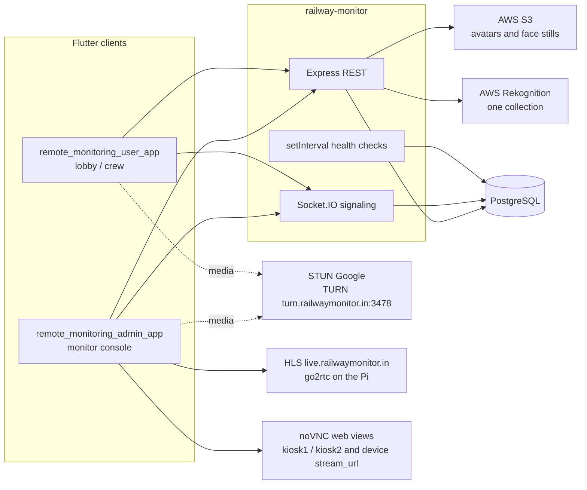

FACT: media for the crew call is peer-to-peer. `NEXTJS_REBUILD_SPEC.md` §1: “The server only signals, stores records, and stores still images. It does not record video today.”

FACT: there is no Redis, no Bull, no separate AI worker, and no Python service inside `railway-monitor` or `kostra-boilerplate`. The only Python service is `remote_monitoring_user_app/face_detection_service`, and it returns face bounding boxes labeled `Unknown`. It is not mounted on the crew main screen.

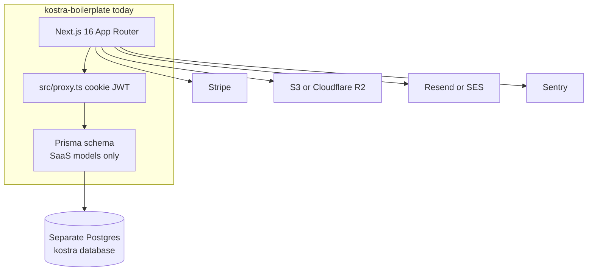

FACT: Kostra and Railway Monitor do not share a database, a user id type, or a role enum. Kostra `User.id` is an autoincrement integer (`prisma/schema.prisma`). Railway Monitor `users.id` is a UUID (`src/modules/users/user.model.js`).

---

## 4. Document conflicts that must be resolved first

These are not implementation bugs. They are disagreements between documents, or inside the requirements file. None of them should be silently decided in code.

### 4.1 Requirements document versus rebuild spec

The rebuild spec yields on roles, zones, and submission visibility. Other disagreements remain.

| Topic | Rebuild spec | Requirements | Impact |
| --- | --- | --- | --- |
| Roles | `SUPER_ADMIN`, `DIVISION_ADMIN`, `MONITOR`, `USER` | `SYSTEM_ADMIN`, `SUPER_ADMIN`, `DIVISION_ADMIN`, `DIVISION_MONITOR`, `LOBBY_USER`, `CREW_USER` | Auth, nav, and every query. Requirements win, per the spec’s own rule. |
| Who creates divisions | Super admin | System admin. Super admin watches only. | Support versus viewing accounts must be different logins. |
| Monitor scope | `monitor_lobby_access` editor | Division monitor sees every lobby in the division. Do not copy the per-lobby list unless a later request needs it. | Drop the access-list editor from the first build. |
| Crew versus desk | One `USER` role | `LOBBY_USER` and `CREW_USER` | Current `USER` rows cannot be migrated without a classification rule. |
| Routes | `(public)`, `(console)`, `(kiosk)` | `(public)`, `(system)`, `(console)`, `(lobby)`, `(crew)` plus an all-divisions overview | Screen map in the spec is the old product. |
| Signup | Public signup and pending approval | Crew is created by the division admin. Forgot-password exists for every role. Public signup is not in the target account model. | REQUIREMENT DECISION REQUIRED: keep public signup or not. |
| Public form | In the v1 acceptance list | “Stays in the product” but is not a first screen (`§8`). Creates `USER` accounts with a shared password today. | Conflicts with six real logins and with crew created by an admin. |
| Submissions per day | One sign-on and one sign-off per crew member per day | One sign-on and one sign-off per crew member **per actual lobby** per calendar date (`§9.3`) | Different unique keys. |
| Recording | “Decide local download or S3” (`§14` phase 6) | Local file on the monitor’s computer. Server stores start/stop facts only. No playback URL (`§5`, `§9.3`). | Requirements already decided. Do not upload video. |
| Form versions | Publish deactivates the previous template. No version table described. | `form_template_version_id`. A later edit creates a new version. Old submissions keep their fields. | Current publish destroys the historical field set. |
| Layout persistence | Save workspace tabs in the database | Layout is remembered on that browser (`§3`) | Do not block MVP on server-saved layouts. |
| Password minimum | Raise API from 6 to 8 | Not numeric in the requirements | Small decision. Spec proposes 8. |
| JWT lifetime | Current tokens never expire; spec says add expiry, refresh, and revoke | Not specified beyond “session” and forced change after admin reset | REQUIREMENT DECISION REQUIRED for refresh versus server revoke. |

### 4.2 Inside the requirements document

**WAITING as a session state versus lobby presence.**

REQUIREMENT §9.7:

> Session states: `WAITING → RINGING → ACTIVE → ENDING → COMPLETED`. Botad online is `WAITING`. The monitor presses Call and the session is `RINGING`.

REQUIREMENT §3 and §9.4, in the same document:

> “Live Lobbies” is the presence list. It comes from the socket, not from the device table. Presence is upserted on heartbeat, not inserted as a new row every 30 seconds. Online lobbies are always on, even when Live session is off.

INFERENCE: a lobby can be online with no session. Creating a `monitoring_sessions` row in `WAITING` for every online lobby would mix presence with calls and would make the two-call count ambiguous.

RECOMMENDATION: keep presence as `ONLINE` / `OFFLINE` with `last_seen` and optional `current_session_id`. Start a session only at `RINGING`. Do not store `WAITING` as a session status.

REQUIREMENT DECISION REQUIRED: §9.7 names `WAITING` as the first session state. That sentence has to be amended or the data model has to create a session before anyone calls.

**`users.lobby_id` versus `home_lobby_id`.**

REQUIREMENT §9.3 puts `lobby_id` on the user, required for lobby user and crew.

REQUIREMENT §9.7 and §10 say the crew user has `home_division_id` and `home_lobby_id`, distinct from the lobby on the session and the submission. Auto-fill stores “the actual lobby of the session, his home lobby, and `form_template_version_id`.”

RECOMMENDATION: treat the user’s lobby as home assignment only. Name the columns `home_division_id` and `home_lobby_id` so queries cannot confuse them with `monitoring_sessions.lobby_id` or `submissions.lobby_id`. Lobby users are assigned to one operational desk; that desk lobby is their only lobby, so home and desk are the same row for them.

**Who may correct a locked form.** §9.3 says a correction is a separate workflow and that neither crew nor division admin edits a `LOCKED` row. It does not say who opens the correction, whether it writes a new submission, or how answers are preserved. REQUIREMENT DECISION REQUIRED. See section 10.

**Section 15 is unaccepted.** The file header says development does not start until those eight items are accepted. They are repeated in section 37. Several are already written as adopted in §9.7 and §10 (checklist versus form, home versus actual lobby, form lifecycle). The header and section 15 still mark them as unconfirmed.

### 4.3 Discovery brief versus written requirements

The inspection task described visual-impairment analysis, `safety_events`, evidence clips, model versioning, and modes `OFF` / `SHADOW` / `ACTIVE`, plus extra modules `VISUAL_IMPAIRMENT_DETECTION` and `DEVICE_MONITORING`.

FACT: none of those strings exist under `railway-monitor/src`, `kostra-boilerplate/src`, or either Flutter `lib/` tree.

FACT: `PRODUCT_REQUIREMENTS_AND_ARCHITECTURE.md` paid modules are only `LIVE_SESSION`, `FACE_DETECTION`, `FORM_SUBMISSION`, and `AI_MONITOR`. Cameras, kiosks, and online lobbies are always on and are not rows in `division_modules`.

FACT: face recognition in the requirements answers “who is this person?” (`§5`). It does not mention intoxication, bottles, pose, gait, or impairment.

REQUIREMENT DECISION REQUIRED: visual impairment is not a written RMO requirement. Do not add it to `division_modules` or the session model until the product owner accepts it. Section 12 describes a boundary that is safe to adopt **if** that decision is yes. It is not a gap in the current build relative to the accepted document set.

---

## 5. Organization, roles, and scope

### 5.1 Target

REQUIREMENT §2 and §4:

```text
System
  └── Zone
        └── Division
              ├── Division admin
              ├── Division monitor
              └── Lobby
                    ├── Lobby user   (desk)
                    └── Crew user    (home assignment)
```

A division belongs to one zone. A lobby belongs to one division. There is no zone-admin role. Moving a lobby or a division is a system-admin action and is audited. Historical submissions keep the division and lobby they were filed under.

Scope (§9.2):

```text
Scope { kind: "system" | "division" | "lobby" | "self" }
```

System admin and super admin are `system`. Division admin and division monitor are `division` with a fixed `divisionId`. Lobby user is `lobby`. Crew is `self`. A list function without a `Scope` argument is not allowed. Filters are SQL `WHERE` clauses, not rows hidden in the browser.

### 5.2 What Kostra has

FACT (`prisma/schema.prisma`): `UserRole` is `ADMIN` | `USER`. There is no organization, tenant, division, or lobby. `User` has `plan`, `credits`, `stripeCustomerId`, `googleId`. Soft delete is `deletedAt`.

FACT (`src/proxy.ts`, `src/lib/routes/config.ts`): protection is an edge proxy (Next.js 16 calls this a proxy; there is no `src/middleware.ts`). It checks a route table and `ADMIN` versus `USER`. It sets `x-user-id`. It does not scope queries.

FACT (`src/store/auth.ts`, `src/lib/utils/http/axios.ts`): the browser also stores the JWT in `localStorage` and sends `x-custom-token`. Server `getAuthUser` reads the HTTP-only cookie only. The header is unused.

INFERENCE: Kostra’s role check cannot be extended to six roles and four scopes by adding enum values alone. Every repository method is written as “the logged-in user” or “any admin,” not as `Scope`.

### 5.3 What Railway Monitor has

FACT (`src/modules/users/user.model.js`):

| Column | Current |
| --- | --- |
| `role` | `SUPER_ADMIN`, `DIVISION_ADMIN`, `MONITOR`, `USER` |
| `status` | `ACTIVE`, `INACTIVE`, `PENDING_APPROVAL` |
| `division_id` | Nullable. Not required for division roles. |
| `lobby_id` | Column does not exist. |
| `zone_id` | Does not exist. |
| `account_origin` | `REGISTERED` or `PUBLIC_FORM` |

FACT (`src/modules/divisions/division.model.js`): `divisions` has `name`, unique `code`, `description`, boolean `status`. No `zone_id`.

FACT (`src/modules/divisions/lobby.model.js`): `lobbies.division_id` is required. Unique `(division_id, name, station_name)`.

FACT (`src/modules/access/monitorLobby.model.js`): `monitor_lobby_access` is the per-lobby grant the requirements say not to copy forward.

FACT (`src/middleware/rbac.middleware.js`): `requireSuperAdmin`, `requireDivisionAdmin`, `requireMonitor`. Legacy alias `ADMIN` maps to `SUPER_ADMIN`. `RBAC_DRY_RUN` can log and allow forbidden actions.

FACT (`src/middleware/division-access.middleware.js`): `requireDivisionAccess` and `requireLobbyAccess` exist. They are not mounted on route files. Lobby checks for `MONITOR` would read `monitor_lobby_access`, but session start does not.

FACT (`src/socket/realtime.manager.js` `validateMonitorLobbyAccess`): super admin is allowed. A `MONITOR` with no `division_id` is allowed. Otherwise the user’s `division_id` must equal the device’s. `DIVISION_ADMIN` and `MONITOR` are then allowed. The function does not read `monitor_lobby_access`.

FACT (`src/auth/auth.middleware.js`): socket auth maps `SUPER_ADMIN`, `DIVISION_ADMIN`, and `MONITOR` to the monitor socket class, and `USER` to the kiosk class. So a division admin can share the monitor socket path today. Requirements §3: the two call slots belong to the monitor. The division admin watches cameras and kiosks and does not take a call slot.

### 5.4 Mapping

| RMO concept | Kostra today | Railway Monitor today | Required change |
| --- | --- | --- | --- |
| Zone | Absent | Absent | New `zones` table. `divisions.zone_id NOT NULL`. |
| Division | Absent | `divisions` | Add zone, keep code. |
| Lobby | Absent | `lobbies` | Keep. |
| System admin | No equivalent. `ADMIN` is the only elevated role. | `SUPER_ADMIN` currently creates divisions. | New role. Do not overload `SUPER_ADMIN`. |
| Super admin | Absent | `SUPER_ADMIN` | Strip structural writes and password reset. |
| Division admin | Absent | `DIVISION_ADMIN` | Keep, scoped by `division_id`. |
| Division monitor | Absent | `MONITOR` | Rename. Whole division, not `monitor_lobby_access`. |
| Lobby user | Absent | Folded into `USER` | Split. |
| Crew user | Absent | Folded into `USER` | Split. Home division and home lobby required. |
| Scope enforcement | Route role only | Ad hoc in services. Middleware unused. Global socket rooms `monitors` and `kiosks`. | `Scope` argument on every list. Rooms `division:{id}` and `lobby:{id}` (§9.4). |

RECOMMENDATION for existing `USER` rows: REQUIREMENT DECISION REQUIRED. The requirements §16 say the research pass must decide which `USER` rows are desks and which are crew. The code does not store that distinction. A practical classification, still needing approval:

- `USER` that has called `register-kiosk` and has no `crew_type` might be a desk, but both crew and desk can use the kiosk app today.
- `crew_type` (`ALP`, `LP`, `TM`) plus face enrollment is evidence of a crew member, not proof.
- `account_origin = PUBLIC_FORM` must not become a lobby login. The public-form guide sets password hash of `12345678`.

Do not auto-migrate `USER` → `CREW_USER` or `LOBBY_USER` without an explicit mapping table reviewed by operations.

---

## 6. Home lobby versus actual operational lobby

### Requirement

REQUIREMENT §4, using the product example:

- Vikram’s home is Bhavnagar / Botad.
- A sign-on, a sign-off, and a live session store the division and lobby where he is standing.
- If he signs on at another Bhavnagar lobby, the submission’s lobby is that lobby. Home stays Botad.
- The division where the event happened can see it. Another division cannot.
- §12: the server sets `division_id` and `lobby_id` from the live session or the desk. The browser does not pick a division. Home lobby is copied from the profile and is not overwritten.

REQUIREMENT §9.3 unique rule: one sign-on and one sign-off per crew member per **actual lobby** per operating date.

### Current behavior

FACT: `users` has `division_id` and no lobby column. There is no `home_lobby_id`.

FACT: `monitoring_sessions.lobby_id` is copied from `device.lobby_id` inside `startMonitoringSession` (`realtime.manager.js`). The session has no `crew_user_id`. The operational lobby is the device’s lobby, not a person’s home.

FACT: `submissions` (`src/modules/forms/submission.model.js`) stores `user_id`, `form_id`, `submission_date`, `staff_type`, `duty_type`, `submission_source`. It does not store `zone_id`, `division_id`, `lobby_id`, `session_id`, or home lobby. A submission is therefore tied to the person, and the person’s current `division_id`, not to the desk where it was filed. If Vikram’s `division_id` later changes, historical lists that join through `users.division_id` would move. The requirements forbid that.

FACT: authenticated `POST /api/forms/submissions/today` does not enforce one row per day. The public endpoint does, via a partial unique index on `(user_id, staff_type, duty_type, submission_date)` where `submission_source = 'PUBLIC'` (migration `20260719180000-public-forms-user-origin-and-submission-meta.cjs`).

### Representation

RECOMMENDATION, minimum columns:

| Entity | Home | Actual place |
| --- | --- | --- |
| `users` (crew) | `home_division_id`, `home_lobby_id` | none |
| `users` (lobby user) | `home_division_id`, `home_lobby_id` meaning the desk they operate | none |
| `users` (division staff) | `home_division_id` only | none |
| `users` (system, super) | both null | none |
| `monitoring_sessions` | optional copy of crew home for display | `division_id`, `lobby_id` of the desk, `crew_user_id` |
| `submissions` | `home_division_id`, `home_lobby_id` copied at save | `zone_id`, `division_id`, `lobby_id`, nullable `session_id` |
| `safety_events` (only if that feature is accepted) | optional crew home | `division_id`, `lobby_id` of the detection |

### Which query uses which

| Question | Filter |
| --- | --- |
| Who belongs to Botad? | `users.home_lobby_id` |
| What happened at Gondal today? | `submissions.lobby_id` or `monitoring_sessions.lobby_id` |
| What may Bhavnagar open? | `division_id` of the **event**, not the crew’s home, when those differ. Requirements §4: the division where the event happened sees it. |
| What may Vikram open? | `submissions.user_id = self` |
| What may the Botad desk open? | Today’s submission for the crew standing at that desk, not every historical Botad row (§5). |
| People list filtered by zone | User’s home division’s zone, which §9.3 also wants denormalized onto the user |

INFERENCE: if Vikram’s home is Bhavnagar and he signs on in another division, §4 says the **event division** sees the submission and the other division’s monitor does not. It does not say whether Bhavnagar (home) also sees it. The example in §4 is another lobby **inside** Bhavnagar. Cross-division sign-on is REQUIREMENT DECISION REQUIRED.

Do not implement `submission.lobby_id = user.home_lobby_id` as a default on the server.

---

## 7. Live monitoring session

### Requirement (§9.7, §10)

A session is the center of the live workflow:

```text
monitoring_session
  ├── crew
  ├── actual division and lobby
  ├── operator (HUMAN or AI)
  ├── state
  ├── checklist
  ├── identity
  ├── recording metadata (no video file)
  └── submission, when one exists
```

`startSession(lobbyId, operator)` is the same function for a human monitor and for the AI monitor. `operator_type` is `HUMAN` or `AI`. `operator_id` is the monitor’s user id or the division’s agent id.

### Current implementation

FACT: there is no `startSession`. The DB function is `startMonitoringSession({ deviceId, monitorUserId, ... })` in `src/socket/realtime.manager.js`, triggered by socket event `start-monitoring` in `src/socket/index.js`.

FACT: `MonitoringSession` columns are `division_id`, `lobby_id`, `device_id`, `monitor_user_id`, `started_at`, `ended_at`, `status`, `disconnect_reason`, `meta`, `access_token`, `token_expires_at`.

FACT: status enum is `ACTIVE`, `ENDED`, `TIMEOUT`, `FORCED`. A partial unique index allows one `ACTIVE` row per `device_id`.

FACT: in-memory `src/state/sessions.state.js` tracks call state `idle` | `connecting` | `connected` | `ended` separately from the DB status. Legacy non-UUID kiosk ids can exist only in memory.

FACT: there is no `crew_user_id`, `operator_type`, checklist table, identity-match table, or recording-metadata table.

FACT: `session_observers` allows extra receive-only viewers (`MAX_OBSERVERS_PER_SESSION`, default 10, `src/constants/observer.constants.js`). The requirements do not describe observers. The rebuild spec does (“Watch session”). REQUIREMENT DECISION REQUIRED: keep observers or drop them. They must not count as a second operator and must not publish media. Current code already rejects observer publish (`OBSERVER_MEDIA_PUBLISH_REJECTED`).

### Ownership and concurrency today

| Rule | Where | Behavior |
| --- | --- | --- |
| One active DB session per device | Partial unique index + `startMonitoringSession` | Second **monitor** on the same device gets `SESSION_ALREADY_EXISTS`. |
| Same monitor, same device | Re-entry if socket matches | Allowed. |
| One monitor, many devices | `sessions.state.js` | Allowed. No cap. |
| Call in progress | In-memory `callState` | One connecting/connected call per kiosk session, not two lobbies per monitor. |
| Transaction | Create plus in-memory map | Not one database transaction. Two monitors can race before the unique index fires. |
| Idle timeout | Comment in `src/socket/index.js` | Disabled. |

The Flutter admin client matches this: `MonitorSocketClient` keeps `Map<String, _KioskSession>` and `startMonitoring` does not stop other kiosks (`remote_monitoring_admin_app/lib/data/dataSources/monitor_socket_client.dart`).

### Can this support the RMO model?

INFERENCE: the table can be extended. The semantics cannot be reused unchanged.

| RMO need | Gap |
| --- | --- |
| Session keyed by lobby and crew, not only by device | Today `device_id` is required and is the uniqueness key. A lobby call is not a device lock. |
| `operator_type` | Absent. |
| Checklist | Absent. Questions exist only as form templates. |
| Identity on the session | Face search is a stateless HTTP call. Nothing stores `IDENTITY_PENDING` / `IDENTIFIED` / `UNKNOWN` on the session. |
| Recording facts | Admin app records locally (`webrtc_recording_service.dart`, web download). Server is not told. |
| AI operator | No agent user, no Hindi speech path, no transcript table. |
| Two-call cap | Absent. The current rule is the opposite shape: many calls per monitor, one monitor per device. |

RECOMMENDATION: keep `monitoring_sessions` and add columns rather than inventing a parallel `calls` table. Stop using “one active row per device” as the call rule. Device streams (camera HLS, kiosk web view) are not sessions.

---

## 8. Session state and lobby presence

### What the code does

| Layer | States | File |
| --- | --- | --- |
| DB session | `ACTIVE`, `ENDED`, `TIMEOUT`, `FORCED` | `monitoringSession.model.js` |
| In-memory call | `idle`, `connecting`, `connected`, `ended` | `sessions.state.js` |
| Socket presence | `is_online`, `last_heartbeat_at`, `offline_reason` | `socketPresence.model.js` |
| Device | `ONLINE`, `OFFLINE`, `MAINTENANCE` plus separate health fields | `device.model.js` |

Presence is already a different table from sessions. Heartbeat updates `socket_presence` (`touchSocketHeartbeat` in `realtime.manager.js`). That part matches §9.4. The table can still grow one row per socket rather than one current row per lobby or monitor; see section 20.

### Recommended lifecycle

This is a RECOMMENDATION that contradicts the literal `WAITING` arrow in §9.7. It matches §3 and §9.4. It needs the decision in section 4.2.

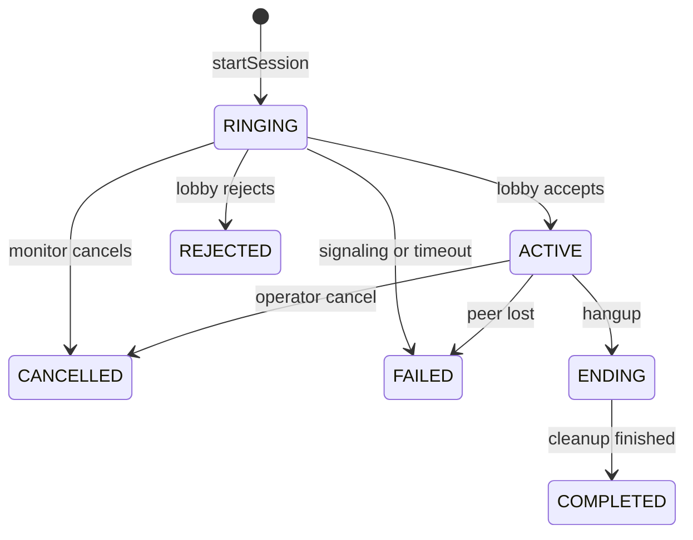

Lobby presence, separate:

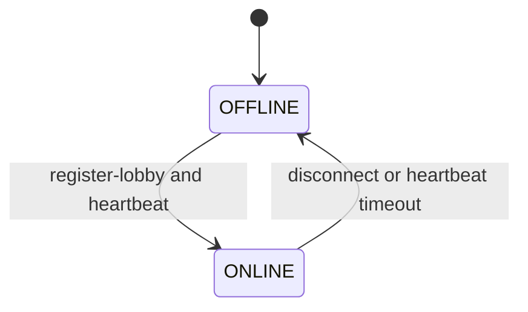

REQUIREMENT §9.7: WebRTC signaling is allowed only in `RINGING` and `ACTIVE`.

Current `forwardWebRtcSignaling` (`src/socket/webrtc-signaling.js`) allows signaling when an in-memory session exists. It does not know `RINGING` versus `ACTIVE`. A call can exchange ICE while DB status is already `ACTIVE`, because DB status is set at `start-monitoring`, before `call-accept`.

RECOMMENDATION: do not insert the DB row as `ACTIVE` at `start-monitoring`. Insert `RINGING` when the monitor calls. Move to `ACTIVE` on `call-accept`. Map today’s `TIMEOUT` and `FORCED` onto `FAILED` or `CANCELLED` only after the product names those cases. Do not keep both vocabularies.

Signaling cleanup: on `REJECTED`, `FAILED`, `CANCELLED`, `COMPLETED`, drop the in-memory peer pairing, leave the socket rooms for that session, and write the audit row in the same transaction as the status change.

---

## 9. Two-concurrent-call limit

REQUIREMENT §3, §9.7, §14:

- One monitor can be in a live call with two lobbies at once.
- A third `startSession` is rejected by the API.
- The screen message only reflects that rejection, so a second browser tab cannot bypass it.
- Cameras, kiosks, and device monitoring do not consume the two slots.
- The division admin does not take a slot.
- The same check applies to the AI operator.

FACT: no `maxSessions` counter exists under `railway-monitor/src`. Tests expect a second monitor to be blocked on the **same device**, not a third lobby to be blocked for one monitor (`tests/realtime/socket.e2e.test.js`, as inventoried).

### How to enforce it

RECOMMENDATION: server-side, inside `startSession`, in one database transaction.

1. Resolve the operator id (human user or division AI operator).
2. Lock that operator row (`SELECT … FOR UPDATE`) so two tabs cannot both count 1.
3. Count sessions for that operator whose status is `RINGING` or `ACTIVE`.
4. If the count is already 2, return a typed error. Do not create a row.
5. Insert the new `RINGING` row in the same transaction.
6. Commit, then emit the socket call.

Do not use a unique index for “maximum two.” Postgres check constraints cannot count sibling rows. The lock is the race control.

Do not count:

- HLS camera viewers
- kiosk web-view panels
- device heartbeats
- `stream_sessions` for CCTV
- observers, if observers remain
- division-admin read-only presence on `/d/live`

AI: the division’s AI operator is the `operator_id`. It gets the same cap of two. REQUIREMENT DECISION REQUIRED: is that two per AI agent, or two across all AI sessions in the division? The text says “the same check applies to the AI operator,” which reads as per operator, not per division.

Browser tabs: the lock makes the third request fail even if both tabs have stale local state. The client should also disable the button after two `ACTIVE`/`RINGING` sessions, as a reflection only.

---

## 10. WebRTC and realtime

### What exists

| Piece | Fact | Path |
| --- | --- | --- |
| Socket.IO 4.7 | Signaling, presence, crew events | `railway-monitor/src/socket/index.js` |
| Kiosk ↔ monitor SDP | `offer`, `answer`, `ice-candidate` only if `sessionsState` has a pairing | `src/socket/webrtc-signaling.js` |
| ICE | Google STUN plus TURN `turn.railwaymonitor.in:3478` | `getIceConfig` in `src/modules/monitoring/monitoring.webrtc.controller.js`. Credentials from `TURN_USERNAME` / `TURN_PASSWORD`. |
| Pi / go2rtc relay | Server forwards SDP to the device over `webrtc:offer` / `webrtc:answer` | `monitoring.handlers.js`, `webrtc-offer.relay.js` |
| CCTV playback | Not WebRTC in the admin app. HLS from `https://live.railwaymonitor.in/` | `remote_monitoring_admin_app/lib/res/app_constants.dart` |
| Kiosk picture | WebView. Hardcoded `kiosk1.railwaymonitor.in` and `kiosk2.railwaymonitor.in` plus API `stream_url` | `kiosk_monitor_screen.dart`, `monitor_overview_screen.dart` |
| MediaMTX | Absent in `railway-monitor/src` and both Flutter `lib/` trees | — |
| cloudflared | Absent in source | Hostnames imply some tunnel, but that is not in the repo |
| noVNC | Client URLs only. Server has command name `OPEN_VNC` | `deviceCommand.model.js` |
| Redis adapter | Absent. Rooms are in-process. | Requirements §9.1: do not add Redis in the first release |
| Rooms today | `monitors`, `kiosks`, `device:{uuid}`, `observers`, `stream:{sessionId}` | Rebuild spec §7 |
| Rooms required | `division:{id}`, `lobby:{id}` | Requirements §9.4 |

REQUIREMENT §9.1: direct path between lobby browser and monitor browser. Lobby sends camera, microphone, and screen. Monitor sends camera and microphone. If the railway network blocks the direct path, media falls back through TURN. The API signals only. It does not relay the video and it does not accept a recording upload.

FACT: the admin `MonitorSocketClient` comment says the monitor sends camera and mic, not screen. The crew client sends screen and camera. That matches the requirement’s direction of media, with one product change: both sides must see both people, with names, plus the lobby screen (`§5`).

FACT: `POST` WebRTC offer under `/api/monitoring` is mounted without `requireAuth` (route inventory). That is a security gap if the offer body can drive a device.

FACT: `GET /webrtc-test` is public (`src/server.js`). The rebuild spec says delete it and the viewer page that contains demo credentials.

### What to add

| Concern | Recommendation |
| --- | --- |
| P2P | `RTCPeerConnection` in the Next.js client. ICE servers from `GET /api/monitoring/ice-config` only. No TURN secret in the browser bundle. |
| STUN / TURN | Keep the existing endpoint. Railway networks will often need TURN. |
| Restrictive NAT | TURN is the fallback the requirements already name. Provider contract and bandwidth are operational, not a Kostra feature. |
| Reconnect | Define ICE restart while status is `ACTIVE`. Do not create a second session. |
| Call termination | `call-end` / `stop-monitoring` → `ENDING` → `COMPLETED`, close peer connections, clear in-memory pairing. |
| Signaling cleanup | Ignore `offer` / `answer` / `ice-candidate` unless status is `RINGING` or `ACTIVE` and the socket is the paired lobby or operator. |
| Session cleanup | Heartbeat timeout moves presence to `OFFLINE` and the session to `FAILED` if it was `RINGING` or `ACTIVE`. Today the session idle timeout is disabled. |
| Second process | Out of scope for v1 (§9.1). When it happens, Socket.IO needs a Redis adapter. Do not add it now. |

Kostra has no `socket.io`, no `RTCPeerConnection`, and no ICE config. This is new UI on top of the existing signaling process, not a Kostra refactor.

Camera HLS and kiosk web views stay outside this peer connection. They do not use `startSession`.

---

## 11. Face recognition (identity only)

REQUIREMENT §5:

- Runs on the lobby camera during a live session, and only when Face detection is on for the division.
- Crew enrolls once from their account.
- Match draws the name. No match draws Unknown. No face draws No face.
- A match proposes identity. It does not by itself assign the submission.
- Session identity is `IDENTITY_PENDING`, then `IDENTIFIED` or `UNKNOWN`.
- A low-confidence match stays a candidate until a person confirms it.
- Search is limited to crew in that division.

### Current service boundary

FACT (`src/services/rekognitionFace.js`):

- Collection id from `AWS_REKOGNITION_COLLECTION_ID`. `ensureCollection()` runs at startup (`src/server.js` `initDB`).
- Enroll: `IndexFaces` via `enrollFace`, route `POST /api/users/me/face/enroll`.
- Search: `SearchFacesByImage`, `FaceMatchThreshold` default **80**. Route `POST /api/face/recognize`, `requireMonitor`.
- Returned confidence is Rekognition `Similarity`.
- Profile table `user_face_profiles`: `rekognition_face_id`, `s3_key`, status `pending` | `active` | `failed`.

FACT: the admin app detects a face locally (ML Kit on device, BlazeFace on web) and then posts a still to `/api/face/recognize` (`monitor_overview_screen.dart`). The video stream is not sent to Rekognition.

FACT: the Python sidecar (`face_detection_service/app.py`) uses DeepFace `extract_faces` and always returns label `Unknown`. It does not search identity and does not score impairment. The rebuild spec says not to port it. AWS Rekognition is the recognizer.

FACT: nothing writes `IDENTITY_PENDING` or confirms a candidate. Nothing filters Rekognition matches to one division. A face enrolled in another division can match if it is in the same collection.

RECOMMENDATION:

- Keep Rekognition (or a later provider) behind `modules/face` in the API. The Next.js app sends a still, not a stream.
- Store matches on `session_identity_matches` (session, candidate user, confidence, status, confirmed_by, model version).
- External image id or face id must include `division_id`, and search results must be discarded when the user is not crew in that division.
- Do not treat a match as alcohol impairment, as a submission assignment, or as `IDENTIFIED` below the confirmation rule.

REQUIREMENT DECISION REQUIRED: the numeric threshold and whether confirmation is the monitor, the lobby user, or the crew member. The code uses 80. The requirements say “confident” and “low-confidence” without numbers.

Enrollment UI is missing in both Flutter apps (rebuild spec §4). The API exists.

---

## 12. Visual impairment — not in the written requirements

This section exists because the discovery task asked for it. It is not a gap against `PRODUCT_REQUIREMENTS_AND_ARCHITECTURE.md`.

### What the task asked

Analyze visible face and body behavior over time. Do not detect bottles, glasses, or drinking. Do not output “drunk,” “intoxicated,” or “alcohol consumed” unless a requirement says so. Separate this from face recognition (“who?”) and from the AI monitor (“can an agent run the checklist?”).

Suggested states: `NORMAL`, `MONITORING`, `ELEVATED_INDICATORS`, `HIGH_INDICATORS`, `INSUFFICIENT_EVIDENCE`.

The model must be allowed to say the evidence is poor: angle, occlusion, lighting, missing lower body, low face or pose confidence, temporary odd behavior. It must not make a medical or legal finding.

### What the repositories contain

FACT: no OpenCV, pose, gait, impairment, or alcohol logic in `railway-monitor` or `kostra-boilerplate`.

FACT: `kostra-boilerplate/package.json` lists `openai` as a **devDependency**. `OPENAI_API_KEY` is in `.env.example`. No file under `src/` calls it.

FACT: background work in Railway Monitor is `setInterval` inside the API process (`deviceHealth.scheduler.js`). There is no queue, no GPU image, and no worker container. `infra/docker-compose.yml` in Kostra runs Postgres and the Next app only.

### Boundary, if the feature is later accepted

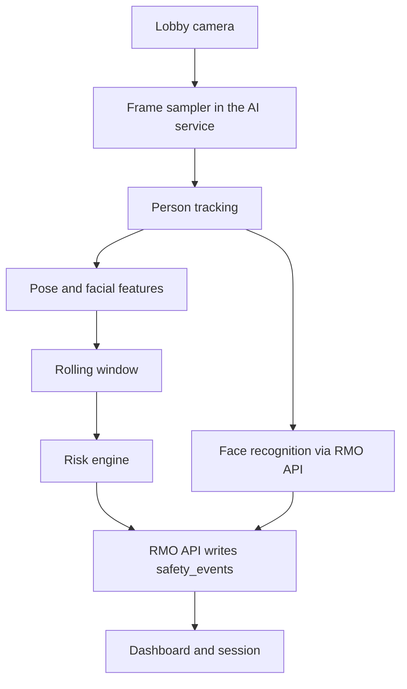

RECOMMENDATION:

- Do not put the model inside Next.js or inside the Express request path.
- A separate process owns OpenCV, pose, temporal windows, and the risk engine.
- It calls the RMO API for identity and to append events.
- Face recognition stays the existing Rekognition (or successor) boundary. The impairment service consumes identity; it does not replace it.
- The AI monitor (Hindi checklist agent) is a third process or module. It does not share weights or outputs with impairment detection.
- Insufficient evidence is a first-class result, not a silent `NORMAL`.

Frequency, as a recommendation only (no current pipeline to measure):

| Stage | Rate |
| --- | --- |
| Video ingest | Continuous on the edge or in the AI process. Not through the Next.js server. |
| Person tracking | High, on the sampled stream. |
| Face recognition | Periodic, and again when the tracked person changes. A still, matching today’s `/api/face/recognize` shape. |
| Pose | Configurable FPS, lower than tracking. |
| Feature aggregation | On each pose sample, in memory. |
| Temporal model | Rolling window, not one frame. |
| Risk engine | When the window updates, not per camera frame. |

REQUIREMENT DECISION REQUIRED before any of this is designed into tables: whether the feature exists, what it may be called in the UI, who sees it, and whether it can create an operational alert. See sections 15–18 and 37.

---

## 13. Forms and versioning

### Requirement

REQUIREMENT §9.3 and §9.7:

```text
form_templates → form_template_versions → form_fields
submissions → submission_answers
```

Every submission points at `form_template_version_id`. Publishing a later version does not change old submissions.

State: `DRAFT` → `SUBMITTED` → `LOCKED`.

- Crew can edit a draft.
- Crew and division admin can both edit while `SUBMITTED`.
- Only the division admin can lock.
- After `LOCKED`, neither crew nor division admin edits the row.
- Correction is a separate workflow.
- One sign-on and one sign-off per crew per actual lobby per operating date.
- Turning Form submission off keeps existing rows and blocks new ones (§3).

AI auto-fill (§10) may set `filled_by = AI` only when every required field is confirmed, validation passes, identity is `IDENTIFIED`, the session is `ACTIVE`, and Form submission is on. Otherwise the form opens as `DRAFT` with confirmed answers filled, and the crew submits (`filled_by = CREW`). A human monitor never auto-fills.

Field types that already exist and must render: `TEXT`, `LONG_TEXT`, `NUMBER`, `DATE`, `TIME`, `DATETIME`, `YES_NO`, `DROPDOWN`, `SIGNATURE` (`question.model.js`). The crew Flutter dialog renders every question as a plain text field (`user_form_dialog.dart`). Sign on / Sign off buttons are commented out in `main_screen.dart`.

### Current model

| Table | Behavior | Path |
| --- | --- | --- |
| `forms` | One row per template. `staff_type` ALP/LP/TM, `duty_type` SIGN_ON/SIGN_OFF, `is_active`. Partial unique index: one active form per staff and duty. | `form.model.js` |
| `questions` | Fields on that form. Soft delete. Stable `key`. | `question.model.js` |
| `submissions` | `user_id` + `form_id` + date. No version id, no state enum, no lobby. | `submission.model.js` |
| `answers` | `answer_text` per question. Unique `(submission_id, question_id)`. | `answer.model.js` |
| `registers` | A book whose columns are questions. Entries are submissions joined by key, not a separate entry table. | `register.model.js` |

FACT (`publishTemplate` in `forms.controller.js`): publish runs in a transaction, locks the row, sets other forms for that staff and duty to `is_active: false`, and sets this form `is_active: true`. Questions stay on the form row. There is no version snapshot. Editing a question after publish changes the field under existing answers that point at `question_id`. If a question is soft-deleted, old answers can dangle relative to the live form.

FACT: new templates are created with `is_active: false` (`parseTemplatePayload`). That is the only draft concept, and it is on the template, not on the submission.

FACT: there is no `LOCKED` state and no correction table.

FACT: forms are global per staff and duty, not per division. The unique index is `(staff_type, duty_type)` where active. Requirements §3 sell Form submission per division, and §11.3 gives Bhavnagar its own templates. A single global active form cannot represent Bhavnagar’s form and Ahmedabad’s lack of forms as different templates. Ahmedabad with the module off must be rejected at the API even if a global form exists.

### Required changes

RECOMMENDATION:

1. Add `division_id` to templates, or a division link, so Bhavnagar and Ahmedabad are not forced to share one active form. REQUIREMENT DECISION REQUIRED: are templates per division or global with a per-division module switch only? §11.3 “Sign-on and sign-off templates” under the division admin implies per division. The current unique index implies global.
2. On publish, copy fields into `form_template_versions` + `form_fields`. Submissions store `form_template_version_id` and never follow the live template.
3. Add `status` on submissions: `DRAFT`, `SUBMITTED`, `LOCKED`.
4. Add actual `zone_id`, `division_id`, `lobby_id`, `session_id`, `home_lobby_id`, `filled_by`.
5. Unique index on `(crew_user_id, duty_type, lobby_id, operating_date)` once the per-lobby rule is confirmed against the rebuild spec’s per-crew-per-day rule.
6. Keep registers as a view over versioned answers. Column mapping must pin question **keys** on a version, not mutable question rows.

### Lifecycle permissions that are specified

| Action | Who |
| --- | --- |
| Submit | Crew. AI only under the §10 rules. |
| Edit draft | Crew. |
| Edit while submitted | Crew and division admin. |
| Lock | Division admin only. |
| Edit after lock | Nobody, through the submission row. |
| See today’s form at the desk | Lobby user, to help the crew submit (§5). |

REQUIREMENT DECISION REQUIRED:

- May the lobby user write answers, or only display them while the crew account submits?
- Who performs a correction after lock?
- Does correction insert a new submission, a `submission_corrections` row, or a new answer version?
- Is the original row immutable either way?
- Does correction require a reason, and is it audited? §9.6 lists “submission edited after the first save” but does not name correction as its own action. Audit it anyway if correction is approved; the actor/before/after helper already matches §9.6.

Do not invent a division-monitor edit right. The monitor can read submissions (§4). Edit while `SUBMITTED` is specified for crew and division admin only.

---

## 14. AI monitor (checklist agent)

This is a written requirement. It is not visual impairment.

REQUIREMENT §10:

- Paid module `AI_MONITOR`, enabled only by system admin, and only when `LIVE_SESSION` is on.
- Same `startSession(lobbyId, operator)` and the same two-call cap.
- Speaks Hindi. Crew answers in Hindi.
- Path is transcript → interpretation → answer with confidence and `CONFIRMED` or `UNCERTAIN`.
- Only a confirmed answer may be copied onto a form field.
- Call audio is not stored. Transcript and AI answers stay on the session.
- Auto-fill also requires Form submission. Without forms, the agent may still talk and must not write a form.

FACT: no speech, transcript, Hindi, or `operator_type` code exists in `railway-monitor/src`.

RECOMMENDATION: an AI worker joins Socket.IO as the division operator. It does not get a private API that skips `Scope` or the module check. Persist `session_checklist_items` and a transcript table with confidence and status. Do not store audio.

REQUIREMENT DECISION REQUIRED: speech vendor, confidence threshold, whether the transcript is shown to the monitor, and retention of transcript text.

---

## 15. Safety events

REQUIREMENT: the written documents do not define `safety_events`.

The discovery task asked for a general event, not impairment columns on `monitoring_sessions`. If the business later accepts visual impairment, this is the shape to review. It is not a migration to run now.

```text
safety_events
  id, session_id nullable
  division_id, lobby_id, crew_user_id nullable
  event_type            -- e.g. POTENTIAL_VISUAL_IMPAIRMENT
  event_status          -- DETECTED, PENDING_REVIEW, CONFIRMED,
                        -- FALSE_POSITIVE, ESCALATED, RESOLVED
  confidence
  detected_at, resolved_at, resolved_by, resolution
  evidence_reference
  model_name, model_version
  metadata jsonb
  created_at
```

Rules that follow from the task, not from the product doc:

- AI output starts as `DETECTED` or `PENDING_REVIEW`. It does not start as a confirmed disciplinary event.
- `CONFIRMED` requires a person. Who that person is: REQUIREMENT DECISION REQUIRED.
- The session row stores identity and checklist. It does not store impairment flags.
- Face match does not create a safety event.

Existing tables that must not be overloaded: `monitoring_audit_logs` (observer actions) and `audit_logs` (CRUD). A safety event is operational data with a review lifecycle. Audit is the trail of who changed it.

---

## 16. Evidence

FACT: S3 in Railway Monitor stores avatars and face-enrollment images, with presigned GET (`src/services/s3Avatar.js`, Rekognition enroll path). Device screenshots are rows in `device_screenshots`.

FACT: Kostra can store files in S3 or R2 (`src/services/external/aws/s3.ts`, `NEXT_PUBLIC_FILE_STORAGE_DRIVER`). That stack is for user uploads in the SaaS app, not evidence.

FACT: call recordings are local files in the admin app. Requirements forbid uploading them.

| Evidence | Option | Tradeoff |
| --- | --- | --- |
| Timestamp and feature JSON | Columns or `metadata` on the event | Small, queryable, still sensitive biometric-adjacent data. |
| Snapshot still | S3, same pattern as face enroll | Needs a retention rule and a private bucket. Presigned GET, short TTL. |
| Short clip | S3 | Much higher privacy and cost. Requirements currently refuse server video for the call. A clip would be a new decision. |
| Model confidence and version | Columns on the event | Required for “why did this fire?”. Low storage cost. |

RECOMMENDATION: if evidence is approved, store metadata in Postgres and bytes in the existing private S3 bucket. Do not put pixels in Postgres. Do not reuse the monitor’s local recording as the evidence file; that file is not on the server by requirement.

RETENTION POLICY REQUIRED for snapshots, clips, feature vectors, and face stills. See section 25.

---

## 17. AI model versioning

No model registry exists.

RECOMMENDATION for any future event or AI checklist answer:

| Field | Purpose |
| --- | --- |
| `model_provider` | Rekognition, or the impairment service |
| `model_name` | Collection or weight name |
| `model_version` | Pinned build |
| `inference_at` | When the score was produced |
| `confidence` | As returned |
| `threshold` | The cutoff in force at that moment |
| `feature_metadata` | JSON of inputs that are allowed to be stored |

Face recognition should record the same fields on `session_identity_matches`, including the threshold 80 that the code uses today, so a later threshold change does not rewrite history.

---

## 18. Detection modes

Not in the requirements.

If impairment is accepted, RECOMMENDATION:

| Mode | Behavior |
| --- | --- |
| `OFF` | Sampler does not run. |
| `SHADOW` | Events are stored. No live alert and no crew-facing message. |
| `ACTIVE` | Events are stored and an operational alert is emitted. |

REQUIREMENT §3: paid modules are on or off for the **whole division**, not per lobby. A detection mode should follow that, as a column on the division module row, not a third global switch and not a per-lobby switch, unless the product owner explicitly wants a pilot lobby.

Server-side: the AI worker reads the mode. The UI hiding a badge is not the control.

`LIVE_SESSION` off must stop face detection and the AI monitor (requirements). It must also stop impairment-on-the-call if that module is added. Form submission stays independent.

---

## 19. Cameras, kiosks, and devices

### Requirement

Always on, not paid modules: cameras, kiosks, online lobbies (§3).

A camera is `device_type = CAMERA`, `is_active`, `lobby_id`. HLS from `stream_url`, else `https://live.railwaymonitor.in/{channel}/index.m3u8`.

A kiosk on this screen is a device `device_type = KIOSK` with a stream URL, often a noVNC page. It is not the crew face camera and not the paid call.

Configuration `ACTIVE` / `DISABLED` is separate from runtime `ONLINE` / `OFFLINE` / `LAST_SEEN` (§9.7). `OFFLINE` does not disable the device.

Division admin names the device and can change name, lobby (same division), stream, and order. The current sidebar Add button is rejected by the app (“Manual camera add is disabled”) and must not be ported.

### Current model

FACT (`device.model.js`): types `KIOSK`, `CAMERA`, `DVR`, `RASPBERRY`, `NVR`. Status enum `ONLINE`, `OFFLINE`, `MAINTENANCE` is stored on the same row as configuration (`is_active`, stream URL, go2rtc fields). Health is also `health_status`, `failure_score`, snapshots in `device_health_snapshots`, heartbeats in `device_heartbeats`.

FACT: runtime and configuration share `devices`. A health writer and an admin edit can touch the same row. `sequelize.sync()` at boot (`src/server.js`) plus migrations is a second schema path; the comment in `initDB` correctly avoids `sync({ alter: true })`, but `sync()` still creates missing tables outside migration review.

FACT: command queue is Postgres `device_command_queue`, not Redis. Commands include `REBOOT`, `RESTART_GO2RTC`, `RESTART_AGENT`, `UPDATE_AGENT`, `CAPTURE`/`TAKE_SCREENSHOT`, `OPEN_VNC`, stream start/stop. The Pi pulls them.

FACT: edge software (go2rtc, the agent, noVNC, any tunnel) is not in these repositories. The API only stores URLs, relays SDP, and queues commands.

### What belongs where

| Concern | RMO application | Edge |
| --- | --- | --- |
| Name, lobby, order, stream URL, enabled flag | `devices` | — |
| Online, last seen, last error | `device_health` or presence upsert | Agent heartbeat |
| HLS packaging | Player in the web app (`hls.js`) | go2rtc or the current HLS host |
| noVNC page | WebView panel if `stream_url` is set | The kiosk machine |
| MediaMTX | Not in repo. Do not assume it. | Only if operations already run it outside this code |
| Reboot, restart agent | Command API, audited | Pi agent |

RECOMMENDATION: split columns or tables so `is_active` is configuration and online/last_seen is health. Do not let a missed heartbeat set `is_active = false`.

`DVR` and `NVR` exist in the enum and are not described in the requirements’ camera/kiosk screens. Keep the rows. Do not design new screens for them until someone asks. REQUIREMENT DECISION REQUIRED only if those types must appear on the lobby canvas.

---

## 20. Presence

REQUIREMENT §9.4 and §9.7: presence is runtime. Upsert online, last seen, and current session. Do not insert a row every heartbeat. Socket rooms are per division and per lobby, not one global room.

FACT: `socket_presence` stores `user_id`, `device_id`, `socket_id` (unique), `role`, `division_id`, `lobby_id`, `last_heartbeat_at`, `is_online`. `touchSocketHeartbeat` updates that row. A checker marks it offline (`startRealtimePresenceChecker`, heartbeat interval 15000 ms, timeout 45000 ms in `realtime.manager.js`).

INFERENCE: this is closer to the requirement than an append-only log. It is still per socket, and monitors join a global `monitors` room (`src/socket/index.js`). At the stated load of about 100 people, one process is enough (§9.1). The global room will leak presence across divisions if a client trusts the room instead of the server filter.

FACT: `filterKiosksForMonitor` (`src/socket/kiosk-visibility.js`) filters the list sent on `register-monitor`. That is application filtering after a global registration, not a division room.

RECOMMENDATION:

- One current presence row per lobby desk and per monitor, updated in place.
- Join `division:{id}` and `lobby:{id}` only.
- `current_session_id` on the presence row, nullable.
- Do not page this table as history. Device heartbeat history already exists and §9.4 says to prune it.

Scalability: acceptable for one Node process and 100 sockets. Not safe for two API processes without a Socket.IO adapter. Requirements defer that.

---

## 21. Module flags

### Requirement

Stored in `division_modules`: `LIVE_SESSION`, `FACE_DETECTION`, `FORM_SUBMISSION`, `AI_MONITOR`. No row means only the three always-on capabilities.

Dependencies, same transaction as the switch (§9.7):

- Face detection cannot be inserted unless live session is on.
- AI monitor cannot be inserted unless live session is on.
- Turning live session off turns both dependents off.
- Form submission is independent.
- Only system admin changes modules.
- UI hide is not the enforcement.

FACT: no `division_modules` table or flag checks in `railway-monitor/src`. Every division with a login can hit forms, face, and monitoring routes if their role allows it.

Kostra has `UserPlan` `FREE` | `PRO` and Stripe prices. That is a per-user SaaS plan, not a per-division module. Do not map `PRO` to Live session.

RECOMMENDATION: a `assertModule(scope, module)` helper called inside the use case, after `Scope` is built. Dependents updated in the same transaction as the parent switch. Cache the division’s module set in memory for a few seconds if needed; §9.4 already allows a 5-second counter cache. Do not cache so long that a system-admin switch is invisible.

The discovery task’s extra modules (`VISUAL_IMPAIRMENT_DETECTION`, `DEVICE_MONITORING`) are not in this list. Device monitoring is part of always-on cameras, kiosks, and health, not a paid flag, unless a later decision says otherwise.

---

## 22. RBAC and data scoping — gaps

Frontend hiding is not sufficient. These are current holes.

| Gap | Where | Why it matters |
| --- | --- | --- |
| Application JWT has no `expiresIn` | `signAccessToken` in `auth.controller.js` calls `jwt.sign(payload, JWT_SECRET)` | Logout cannot revoke. A stolen token works until the secret rotates. |
| Fallback secret | Same file: `process.env.JWT_SECRET \|\| 'demo-secret-key-change-in-production'` | A misconfigured process signs forgeable tokens. |
| CORS `origin: '*'` | `src/server.js` `corsOptions` | `.env.example` documents `CORS_ORIGIN`, but the code does not read it. |
| Login not rate-limited | Rebuild spec §15 | Public form routes are limited. Login is not. |
| Password reset reports success when email is only logged | `email.service.js` returns `{ ok: true, logged: true }` if `RESEND_API_KEY` is empty | Caller cannot tell that no mail was sent. |
| `requireDivisionAccess` unused | `division-access.middleware.js` | Each controller scopes itself, or does not. |
| Session start ignores `monitor_lobby_access` | `validateMonitorLobbyAccess` | The table and the socket disagree. The target product drops the table; until then, behavior is inconsistent. |
| Monitor with null `division_id` is allowed | Same function | Breaks division isolation for old tokens. |
| Division admin can start a monitor session | Socket class mapping | Takes a call path the requirements reserve for the monitor. |
| WebRTC offer route without auth | Monitoring routes | Device relay should require a device or user credential. |
| Public `GET /api/auth/users` and `POST /api/auth/register` | `auth.routes.js` | Legacy in-memory users. Spec says remove. |
| Device token secret | `POST /api/auth/device-token` | Separate from user JWT. Spec says it was shipped inside the Flutter app. |
| Public-form password `12345678` | `docs/public-form-integration.md` | Those accounts can log in. |
| `RBAC_DRY_RUN` | `rbac.middleware.js` | Can allow forbidden actions if left on. |
| Kostra proxy skips role check when the HTTP method is missing from `accessTo` | `src/lib/routes/utils.ts` | Example: route config lists `PUT` for blogs while the handler is `PATCH`. Authenticated non-admins can pass the proxy. |
| Kostra campaign GET/PUT by id | `src/app/api/campaigns/[id]/route.ts` | No owner check. Fine for a single admin SaaS. Not a pattern to copy into division data. |
| Kostra localStorage token | `src/store/auth.ts` | XSS would expose it. The server ignores it, which is confusing and should not be copied. |
| Submission lists | Join via user, no `division_id` on the row | A client can be given another division’s rows if a query forgets the user filter. |

RECOMMENDATION for the rebuild:

1. Build `Scope` in one place from the session, never from the body.
2. Repositories require `Scope`.
3. Module check after scope.
4. Audit write in the same transaction as the change.
5. Short-lived access token. REQUIREMENT DECISION REQUIRED on refresh cookies versus a server revoke list. The rebuild spec asks for both expiry and revoke. Kostra already issues a 24-hour cookie JWT (`src/lib/auth/jwt.ts`, `.setExpirationTime('24h')`) and has logout that clears the cookie (`src/app/api/auth/logout/route.ts`) without a server-side revoke list. That is better than Railway Monitor’s non-expiring JWT and still does not invalidate a stolen cookie before 24 hours.
6. Do not port Kostra’s `ADMIN`/`USER` route table as the RMO permission model. Keep the idea of a central route config for the web UI only.

---

## 23. User lifecycle and passwords

| | Requirements | Railway Monitor | Kostra |
| --- | --- | --- | --- |
| Status | `PENDING` → `ACTIVE` → `DISABLED`. `LOCKED` is only an auth block. Disable does not delete submissions. | `PENDING_APPROVAL`, `ACTIVE`, `INACTIVE`. No `LOCKED`. | No status enum. Soft delete `deletedAt`. Signup uses email OTP, then the user exists. |
| Login identifier | User id, one login page, area chosen by role (§11.7) | `POST /api/auth/login` with `user_id` + password. Lookup case-insensitive. | Email + password, plus Google. |
| Forgot password | Every role, including crew. Generic response. Link expires. Token stored as a hash, single use. | Implemented. TTL `PASSWORD_RESET_TTL_MINUTES` (default 30). SHA-256 hash on the user row. | Email OTP (`EmailOTP`), not a link token. |
| Change while logged in | Current password, new password, confirmation. | No dedicated route. `PATCH /api/users/me` can set `password`. | Reset is OTP. Settings pages for general/users are linked from `siteConfig.ts` and several targets have no page. |
| Admin reset | Division admin: crew and lobby in their division. System admin: anyone, including staff. Temporary password shown once, force change, audit. Not emailed to a shared inbox. | `PATCH /api/users/:id` with `password`. No force-change flag. No “show once” flow. | Admin can update users. No temporary-password flow. |
| Sessions | Not specified beyond login. | No refresh store. No revoke. | Cookie JWT 24h. `GET /api/auth` issues a new JWT. |
| Logout everywhere | Rebuild spec wants revoke. Requirements do not spell it out. | Client deletes the token. | Cookie clear only. |
| Role change | Not specified. | Old JWT keeps the old `role` claim until it is discarded. Because it never expires, a demoted user stays elevated. | 24h cookie has the same stale-claim window. |
| Password reset invalidates other sessions | Not specified. | Reset changes `password_hash` only. Outstanding JWTs still work. | Same, until cookie expiry. |

REQUIREMENT DECISION REQUIRED:

- Is `LOCKED` a column, a counter of failed logins, or out of scope for v1? The requirements name it and do not define the trigger.
- After role change, disable, or admin password reset, must all sessions die immediately? The stale JWT behavior says yes, and it needs a `token_version` or a revoke list. The requirements do not say it explicitly.
- Public signup and `PENDING_APPROVAL`: keep for crew self-registration (rebuild spec) or only admin-created accounts (requirements §4)?

Do not use Kostra Google login for crew. The requirements are user id and password.

Do not use Kostra’s email OTP as the only reset path. The requirements are a one-time link. Kostra’s OTP code can inform the email sender; the token design in Railway Monitor is the one to keep.

---

## 24. Audit logging

### What exists

FACT (`src/modules/audit/auditLog.model.js`): `user_id`, `action`, `entity_type`, `entity_id`, `old_data`, `new_data`, `created_at`. No `division_id` column. No read API.

Writers include session start/stop/force/timeout/restore, device commands, division and lobby CRUD, device CRUD, manual health recovery (`createAuditLog` callers in services and `realtime.manager.js`).

FACT: `monitoring_audit_logs` is a second log for observer join/leave and signaling denials (`monitoring-audit.service.js`). It has `division_id` and `lobby_id`.

FACT: Kostra has no audit table.

### Requirement §9.6

Always audit: zone/division/lobby changes, module toggles, account create/disable/assignment, password reset by someone other than the owner, form publish, submission edited after first save, call started and ended, recording started and stopped.

Fields: actor, action, entity, entity id, division id, timestamp, before, after. Password reset must not store the new password. The system screen can filter by division, actor, and day.

| RMO event | Today |
| --- | --- |
| User and role changes | Not consistently in `audit_logs` (user controller was not in the writer list above). |
| Module changes | No module table. |
| Password reset | Not audited as its own action. |
| Form publish | Not in the writer list found. |
| Submission edit | Not audited. |
| Session start/end | `SESSION_START` / `SESSION_STOP` and related. |
| Recording start/stop | Not sent to the server. |
| Safety event review | No such entity. |
| Config changes | Division, lobby, device writes are audited. |

RECOMMENDATION: one `audit_logs` helper, called inside the write transaction, with `division_id`. Keep observer media denials, either in the same table or in the existing monitoring log, but add `GET /api/audit` scoped by `Scope`. Super admin and system admin can pass a division filter. Division admin sees their division. Monitors do not need the full audit screen unless a decision says so. §11.1 shows `/system/audit` for system admin. It does not give division admin an audit page. REQUIREMENT DECISION REQUIRED if division admin should read their own audit.

---

## 25. Retention and privacy

REQUIREMENT §9.7: “Retention is a policy, not a default we invent now.” Forms are the long-term business record. Session metadata is kept. AI transcript and checklist follow the rule once chosen. Face data is stricter than forms. Recordings stay on the monitor’s computer.

RETENTION POLICY REQUIRED for every row below. No duration is stated anywhere in the inspected documents.

| Data | Where it lives today | Privacy note |
| --- | --- | --- |
| User profile | `users` | Identity of railway crew. Email is required in the current model and in the requirements (reset link). |
| Password hash and reset hash | `users` | Reset hash must be cleared after use. Already the design. |
| Face enrollment image | S3 + `user_face_profiles` | Biometric. Stricter than forms. Division-scoped search does not exist yet. |
| Face match metadata | Not stored, only returned on the HTTP response | If stored on the session, it is biometric-adjacent. |
| Live session metadata | `monitoring_sessions` | Who talked to whom, when. |
| Checklist and AI transcript | Absent | Speech content. Audio must not be stored (§10). |
| AI feature vectors | Absent | Can re-identify a person. Treat like biometrics if collected. |
| Safety events | Absent | Operational allegation if shown to staff. Not a medical record, and must not be labeled as one. |
| Evidence snapshot or clip | Absent | Same as biometrics. |
| Call recording | Monitor’s computer only | Server must not gain a copy. Local disk policy is outside this product. REQUIREMENT DECISION REQUIRED whether the employer’s device policy is in scope. |
| Forms and submissions | `submissions`, `answers` | Official duty record. Long-term by requirement, duration unset. |
| Registers / Excel | Generated from answers | Same retention as submissions. |
| Device screenshots | `device_screenshots` | May show people. |
| Audit logs | `audit_logs` | Needed to explain password resets and module changes. |
| Socket presence | `socket_presence` | Operational. Should not become an indefinite location history. |
| Public-form accounts | `users` with shared password | Security defect, not a retention choice. |

Other implications:

- Presigned S3 URLs must stay short (code default comment: 900 seconds).
- Logs must not include reset tokens, passwords, or raw face bytes. `email.service.js` logs the text body when Resend is unset. That can include a reset URL.
- Cross-division face matches are a privacy bug, not only a product bug.
- Kostra’s Sentry tunnel (`next.config.mjs`) will capture web errors. Scrub session and face payloads before enabling it on RMO screens.

---

## 26. Kostra module classification

Stack FACT (`package.json`): Next.js 16.0.10, React 19.2, Prisma 7.1, PostgreSQL via `@prisma/adapter-pg`, Tailwind 4, Zod, React Hook Form, TanStack Query and Table, Zustand, jose, bcryptjs, Stripe, Sentry, Resend, AWS S3 and SES SDK, TipTap, Recharts, Sharp. Node `>=22`. Tests: Jest. Deploy hints: `nixpacks.toml`, `infra/Dockerfile`, `output: 'standalone'`.

| Module | Decision | Why |
| --- | --- | --- |
| App Router, layouts, route groups | KEEP | Requirements want several areas with different layouts. Kostra already splits `(branding)` and `app`. |
| `src/proxy.ts` route ACL | MODIFY | Central gate is useful. Role enum, scopes, and method coverage must change. Do not keep SaaS paths in the table. |
| Cookie JWT (`src/lib/auth/jwt.ts`) | MODIFY | HTTP-only cookie matches the rebuild spec. Payload is SaaS-shaped (credits, plan, Stripe). Expiry exists (24h). Need RMO claims: role, division, lobby, token version. |
| Email/password + forgot/reset | MODIFY | Flows exist (`src/services/internal/auth/auth.ts`) as OTP. RMO wants a link, user id login, and the Railway Monitor token-hash design. |
| Google OAuth | REMOVE | Not an RMO login. `src/app/api/auth/google/verify/route.ts`, `GoogleSignInButton.tsx`. |
| Signup OTP as self-serve SaaS | REMOVE or REPLACE | Only if public crew signup is rejected. See section 23. |
| `ADMIN` / `USER` enum | REPLACE | Six RMO roles. Do not map `ADMIN` → system admin silently. |
| Prisma client and migrations | MODIFY | Keep the tool only if the team chooses Prisma for the RMO schema. Do not migrate RMO into the current models. |
| Current Prisma models (User through Campaign) | REMOVE from the RMO database | SaaS domain. See section 28. |
| Repository / service layering | KEEP | `src/services/repositories` and `src/services/internal` match the requirement that SQL stays out of route files. Point them at RMO modules. |
| Zod schemas | KEEP | Pattern is what the rebuild spec asks for. Replace blog/package schemas. |
| TanStack Query hooks | KEEP | Same. |
| Zustand `auth` store | MODIFY | Stop persisting the token in `localStorage`. Session restore can keep a user profile in memory. |
| Zustand credits store | REMOVE | No credits in RMO. |
| shadcn / `src/components/ui` including `data-table.tsx` | KEEP | Rebuild spec names this set. |
| Atoms, dialogs, sidebar | MODIFY | Re-skin as an operations console. Marketing components go away. |
| TipTap editor | REMOVE | Blogs and campaign HTML. Not used by duty forms. A signature pad is new, not TipTap. |
| Stripe and billing | REMOVE | `src/services/external/stripe`, `src/app/api/billing`, `src/app/api/webhooks/stripe`, billing settings page. |
| Credits | REMOVE | `CreditService`, credit history UI. |
| Packages | REMOVE | SaaS plans. |
| Blogs, categories, public blog | REMOVE | Marketing. |
| Contact submissions | REMOVE | Generic contact form, not crew forms. |
| Email templates and campaigns | REMOVE | Not in RMO. Password mail should be one transactional template in the email driver. |
| File upload / S3 helpers | MODIFY | Reuse presign and private bucket for avatars and, later, evidence. Drop public marketing uploads. |
| Email factory (Resend, SES, test driver) | MODIFY | Keep one driver for reset mail. Railway Monitor already uses Resend. Pick one. |
| Sentry | KEEP | `instrumentation.ts`, `sentry.*.config.ts`. Scrub sensitive payloads. |
| Branding pages, hero, privacy, terms | REMOVE from the product shell | Requirements §11: “a calm operations console, not a marketing site.” Privacy copy may still be needed legally. REQUIREMENT DECISION REQUIRED whether a public marketing site stays on this codebase. |
| Onboarding wizard | REMOVE | SaaS `isOnboarded`. RMO uses role landing pages (§11). |
| `openai` devDependency | REMOVE | Unused. |
| Jest and `src/test` | MODIFY | Keep the harness. Replace package/auth SaaS tests with RMO tests (section 32). |
| Docker / CI | MODIFY | Postgres service in CI is reusable. The app container must not assume Stripe or blog routes. |
| `middleware.ts` | NEW (or keep proxy) | Next 16 uses `src/proxy.ts`. Follow the framework file that already exists. Do not add a second middleware with different rules. |

---

## 27. Kostra → RMO mapping

| Existing Kostra component | Location | Current purpose | RMO requirement | Decision | Required changes | Risk |
| --- | --- | --- | --- | --- | --- | --- |
| Next.js App Router | `src/app` | Marketing site plus `/app` console | Five areas after login (§11) | MODIFY | New route groups. Delete SaaS pages. | Large UI rewrite. Low domain reuse. |
| Route protection | `src/proxy.ts`, `src/lib/routes/config.ts` | Cookie JWT, ADMIN/USER | Scope plus module on every request | MODIFY | Six roles. Fail closed when a method is omitted. | Current method mismatch is a security bug if left in place. |
| Auth service | `src/services/internal/auth/auth.ts` | Email signup, OTP, login | User id, link reset, admin reset | REPLACE | Align with Railway Monitor auth, then extend. | Two auth designs if both stay. |
| User model | `prisma/schema.prisma` `User` | Integer id, email unique, plan, credits | UUID, `user_id`, six roles, home lobby | REPLACE | Do not alter this table into crew. New model matching `users` in Railway Monitor. | Id type clash. |
| PostgreSQL | `POSTGRES_URL`, Prisma | Kostra DB | RMO DB already in Railway Monitor | MODIFY | One database: the RMO schema. Kostra’s DB is not the system of record. | Running two schemas will split identity. |
| S3 / R2 | `src/services/external/aws/s3.ts` | User files | Avatars, face stills, later evidence | MODIFY | Private bucket, presign, no public blog images. | Bucket policies. |
| Sentry | `src/instrumentation.ts` | Error tracking | Keep for the web app | KEEP | Scrubbers. | Biometric data in breadcrumbs. |
| Zustand | `src/store/auth.ts` | Persisted user and token | Server session is the source of truth | MODIFY | Memory-only profile. | XSS via localStorage if unchanged. |
| Zod | `src/schemas` | Form and API validation | Same, for RMO payloads | KEEP | New schemas. | None if old schemas are deleted. |
| React Query | `src/hooks/use*.ts` | SaaS CRUD | Division-scoped queries | MODIFY | Keys must include division and date. | Cache leaking across divisions if the key omits scope. |
| UI table | `src/components/ui/data-table.tsx` | Admin tables | `DataTable` with today, lobby filter, empty, retry (§11) | MODIFY | Add those states. | None. |
| Dialogs | `src/components/molecules/common/Dialog.tsx` | Modals | `ConfirmDialog`, `FormSheet` | MODIFY | Rename and narrow. | None. |
| Sidebar | `src/lib/constants/sidebar-navigation.ts` | SaaS nav by ADMIN/USER | Nav from role config (§11) | REPLACE | One config array per area. | Files item is ADMIN-only in the sidebar while the API allows USER. Do not copy that drift. |
| API route handlers | `src/app/api/**` | SaaS REST | RMO HTTP stays on Express (§9.1) | REMOVE for SaaS routes. Do not rehome signaling here. | Web BFF only if a cookie must be set. Domain writes stay on the API. | Putting WebRTC state in route handlers fights the spec. |
| Stripe | `src/services/external/stripe` | Subscriptions | Not a requirement | REMOVE | Delete routes and env. | None for RMO. |
| Credits | `src/services/internal/credit.ts` | Balances | None | REMOVE | — | `deductCredits` is unused even in Kostra. |
| Blogs | `src/app/api/blogs`, branding blog | CMS | None | REMOVE | — | Public routes. |
| Categories | `src/app/api/categories` | Blog tags | None | REMOVE | — | — |
| Packages | `src/app/api/packages` | Sellable plans | Division modules are not Stripe packages | REMOVE | Modules are `division_modules`. | Mapping packages to modules would be a false abstraction. |
| Contact | `src/app/api/contact` | Inbox | None | REMOVE | — | — |
| Email campaigns | `src/app/api/campaigns` | Bulk mail | None | REMOVE | — | Cron route uses `CRON_SECRET`. |
| Email OTP | `EmailOTP` model | Signup and reset | Link token on the user or `password_resets` | REPLACE | Use Railway Monitor’s hash and TTL. | — |
| Resend driver | `src/lib/email/drivers/resend.ts` | Transactional | Reset email | KEEP | One template. Fail the request when the provider is down, once the product accepts that (rebuild spec). Requirements do not explicitly say to fail closed. | Today Railway Monitor returns success when mail is only logged. |
| Google | `src/app/api/auth/google` | OAuth | None | REMOVE | — | — |
| TipTap | `src/components/molecules/editor` | Rich text | None for v1 | REMOVE | — | — |
| Recharts | `package.json` | Available | Form analytics and registers already chart in Flutter | KEEP | Use only on analytics. | — |
| Tests | `src/test` | Auth and packages | RBAC, scope, sessions, forms | REPLACE | See section 32. | — |
| Docker | `infra/docker-compose.yml` | Local Postgres and app | Web only | MODIFY | API and Socket.IO remain a separate process. | — |
| CI | `.github/workflows/ci.yml` | Lint, build, Jest | Keep for the web app | MODIFY | Drop SaaS env (Stripe, OpenAI) when unused. | — |

---

## 28. SaaS removal list

Verified by location. Nothing was deleted.

| Area | Evidence it is only boilerplate | Recommendation |
| --- | --- | --- |
| Stripe checkout, portal, webhooks | `src/app/api/billing/**`, `src/app/api/webhooks/stripe/route.ts`, `src/services/external/stripe/**` | Remove from the RMO app. |
| Credits | `CreditHistory` model, `src/app/api/users/credits/**`, `src/store/credits.ts` | Remove. |
| Packages | `Package` model, `src/app/app/packages` | Remove. |
| Blogs and categories | `Blog`, `Category`, branding `/blog` | Remove. |
| Contact management | `ContactSubmission`, `src/app/app/contact-management` | Remove. |
| Email campaigns and templates | `Campaign`, `EmailTemplate`, cron `process-scheduled` | Remove. |
| Marketing landing | `src/app/(branding)/**`, `src/components/branding/**` | Remove from the console host. |
| Google sign-in | `src/components/molecules/common/GoogleSignInButton.tsx` | Remove. |
| Demo mode forcing ADMIN | `src/services/repositories/user/index.ts` when `IS_DEMO === 'true'` | Remove. Dangerous if copied. |
| Sitemap / robots scripts | `package.json` `verify-sitemap` | Remove with marketing routes. |

Keep, because RMO needs the same mechanism: password hashing, cookie session, Zod, tables, dialogs, Sentry, private object storage, one email sender, CI against Postgres.

Railway Monitor features that look extra but the requirements say to keep (§8): CCTV, face identification, registers, Excel export, device commands, public form. They are not first screens. Public form conflicts with account security until the shared password is removed (section 4.1).

---

## 29. Database

### 29.1 Kostra (do not extend in place)

Models in `prisma/schema.prisma`: `User`, `Package`, `File`, `CreditHistory`, `Blog`, `Category`, `BlogCategory`, `EmailOTP`, `ContactSubmission`, `EmailTemplate`, `Campaign`, `CampaignRecipient`.

Enums: `UserRole`, `UserPlan`, `OtpPurpose`, `ContactPurpose`, `ContactStatus`, `CreditTransactionType`, `CreditOperation` (only `INITIAL_CREDITS`), `EmailType`, `CampaignStatus`, `CampaignRecipientStatus`.

Migrations: `prisma/migrations/20250926125853_initital_schema`, `prisma/migrations/20260105065503_email_template_and_campaign_added`.

No audit table, no session table, no organization, no forms in the duty sense.

### 29.2 Railway Monitor (system of record)

Registered in `src/models/index.js`.

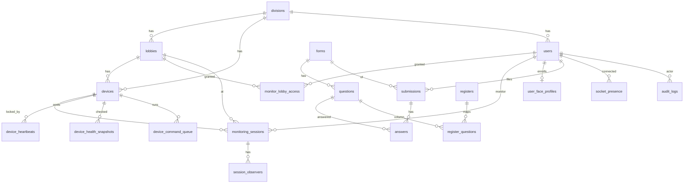

Important constraints:

| Constraint | Table |
| --- | --- |
| Unique `user_id`, unique `email` | `users` |
| Unique division `code` and `name` | `divisions` |
| Unique `(division_id, name, station_name)` | `lobbies` |
| Unique `(division_id, lobby_id, device_name)` | `devices` |
| One `ACTIVE` session per `device_id` | `monitoring_sessions` partial unique |
| One active form per `(staff_type, duty_type)` | `forms` partial unique |
| Unique `(submission_id, question_id)` | `answers` |
| Unique public submission per user, staff, duty, date | `submissions` partial unique |
| Unique idempotency key when present | `submissions` |
| Unique `(user_id, lobby_id)` | `monitor_lobby_access` |

Auth/session structures: password hash and reset hash on `users`. No refresh-token table. Monitoring session has its own 15-minute `access_token` (`startMonitoringSession`). Socket presence is separate.

Organization: division → lobby → device. No zone.

Forms: `forms` / `questions` / `submissions` / `answers`. Not versioned.

Devices: configuration and runtime on `devices`, plus heartbeat, snapshot, log, screenshot, command queue, `stream_sessions`.

Audit: `audit_logs` and `monitoring_audit_logs`.

### 29.3 Minimum RMO model

Evolve the Railway Monitor tables. Do not create a second parallel set.

| Concept | Recommendation |
| --- | --- |
| `zones` | New table. `divisions.zone_id` required. |
| `divisions`, `lobbies` | Keep. |
| `division_modules` | New. Unique `(division_id, module)`. |
| `users` | Keep UUID. Replace role enum. Add home division and home lobby. Status enum change. |
| `monitor_lobby_access` | Do not use for the new monitor role (§4). Keep until migration of old monitors is done, then drop. |
| `monitoring_sessions` | Keep. Add `crew_user_id`, `operator_type`, `operator_id`, state enum. Stop unique-by-device for calls. |
| `session_checklist_items` | New. |
| `session_identity_matches` | New. |
| `session_recordings` | New. Facts only: who started, when. No storage key. |
| `session_ai_answers` | New, for transcript interpretation. No audio column. |
| `forms` → templates | Add division. Publish writes a version row. |
| `form_template_versions`, `form_fields` | New. Old `questions` can be the draft fields on the template. |
| `submissions`, `answers` | Add scope columns, version id, status, `filled_by`. |
| `registers` | Keep as column mapping onto field keys. |
| `devices` | Keep. Treat `is_active` as configuration. |
| `device_health` | Prefer existing snapshots plus a current-status upsert. Do not add a third health model without retiring columns on `devices`. |
| `socket_presence` | Keep as current state. |
| `audit_logs` | Add `division_id`, before/after already exist as `old_data` / `new_data`. |
| `safety_events` | Do not add until the feature is accepted. |
| `password_resets` | Requirements want a table. Today the hash sits on `users`. A table is cleaner for admin-versus-self (`requested_by`) and single use. Either is acceptable if the hash, expiry, and `used_at` exist. |

Indexes the requirements name (§9.3, §9.4): `(role, division_id, status)`, `(division_id, lobby_id, role)`, submissions `(division_id, submission_date)` and `(division_id, lobby_id, submission_date)` and `(user_id, submission_date)`, divisions `(zone_id, status)`, lobbies `(division_id, status)`.

---

## 30. API analysis

Pattern today: Express routers mounted in `src/server.js`. Controllers often query Sequelize directly. There is no shared `Scope` object.

Target pattern (§9.5): a route parses input, calls one use case, returns. SQL lives in the module repository. Permission uses `Scope`.

### Railway Monitor routes (current)

Auth is summarized. “Monitor+” means `requireMonitor`, which includes division admin and super admin.

| Route | Method | Auth today | Purpose | RMO mapping | Decision |
| --- | --- | --- | --- | --- | --- |
| `/api/auth/login` | POST | Public | User id + password, non-expiring JWT | Keep, add expiry, rate limit, pending/disabled messages | MODIFY |
| `/api/auth/signup` | POST | Public | Creates `USER`, often `PENDING_APPROVAL` | Conflicts with admin-created crew | REQUIREMENT DECISION |
| `/api/auth/forgot-password` | POST | Public | Generic message, Resend | Keep for every role | MODIFY (fail if mail cannot send, once decided) |
| `/api/auth/reset-password` | POST | Public | Hash token, min length 6 | Keep, consider min 8 | MODIFY |
| `/api/auth/change-password` | — | Absent | — | Required by §6 | NEW |
| `/api/auth/device-token` | POST | Shared secret | Legacy device JWT, 24h | Spec says stop shipping this secret in clients | REMOVE after clients move |
| `/api/auth/register`, `/api/auth/users` | POST/GET | Public | In-memory users | Spec says remove | REMOVE |
| `/api/users` | GET/POST | Admin roles | List and create | Scope by division. Split lobby and crew. | MODIFY |
| `/api/users/me` | GET/PATCH | Any JWT | Profile | Keep. Password change should not be a raw hash field. | MODIFY |
| `/api/users/me/avatar` | POST | Any JWT | S3 avatar | Keep | KEEP |
| `/api/users/me/face/enroll` | POST | Any JWT | Rekognition index | Crew only, division collection filter | MODIFY |
| `/api/users/pending`, approve, reject | GET/PATCH | Admin | Approval queue | Only if public signup stays | REQUIREMENT DECISION |
| `/api/face/recognize` | POST | Monitor+ | Search by still, threshold 80 | During live session, module on, division filter, write identity match | MODIFY |
| `/api/forms/templates` | CRUD | Division admin | Global templates | Per division, versioned publish | MODIFY |
| `/api/forms/templates/:id/publish` | PATCH | Division admin | Flip `is_active` | Snapshot a version | MODIFY |
| `/api/forms/today` | GET | User | Active form | Needs module, actual lobby, version | MODIFY |
| `/api/forms/submissions/today` | POST | User | Answers | Set actual lobby from desk/session. Enforce uniqueness. State machine. | MODIFY |
| `/api/forms/submissions/me` | GET | User | History | Self scope | KEEP |
| `/api/public/forms/*` | GET/POST | Public, rate limit | No-login form, creates users | Keep only after shared password is removed | MODIFY |
| `/api/registers` | CRUD | Division admin / super admin | Books and XLSX | Scope and versioned columns | MODIFY |
| `/api/divisions` | GET | Monitor+ | List | Super/system see all. Writes become system admin. | MODIFY |
| `/api/divisions` | POST/PATCH | Super admin | Create | System admin, requires zone | MODIFY |
| `/api/lobbies` | * | Monitor+ read, division admin write | CRUD | Writes move to system admin (§4 table). Division admin does not create lobbies in that table. | MODIFY |
| `/api/devices` | * | Monitor+ read, division admin write | Inventory | Keep. Separate config from health. | MODIFY |
| `/api/agents` | * | Admin | Pi agent | Keep with device module, not a paid flag | KEEP |
| `/api/monitoring/ice-config` | GET | Public | STUN/TURN | Keep. No secrets in the client. | KEEP |
| `/api/monitoring/.../webrtc/offer` | POST | No `requireAuth` on this path | Relay SDP to Pi | Require device or user auth | MODIFY |
| `/api/monitoring` device ops | POST | Monitor+ | Reboot, screenshot, go2rtc | Audit. Division scope. | MODIFY |
| `/api/streams` | * | Session flavored | KIOSK or CCTV stream rows | Do not count as the two-call limit | MODIFY |
| `/api/health`, `/api/analytics` | GET | Monitor+ | Unused by Flutter | Screens later, not first | KEEP |
| `/api/audit` | — | Absent | — | System screen §11.1 | NEW |
| Zones, modules, sessions REST | — | Absent | Socket-only sessions | `startSession` must be enforceable in the API, not only by trusting the socket client | NEW |
| `/health`, `/api-docs`, `/webrtc-test` | GET | Public | Ops, Swagger, demo | Delete `/webrtc-test` | MODIFY |

Socket events that matter: `register-kiosk`, `register-monitor`, `start-monitoring`, `stop-monitoring`, `force-stop-monitoring`, `call-request`, `call-accept`, `call-reject`, `call-end`, `offer`, `answer`, `ice-candidate`, `heartbeat`, `crew-sign-on`, `crew-sign-off`, `toggle-video`, `toggle-audio`, observer events, device command pull. These stay on Socket.IO. `start-monitoring` must call the same use case as HTTP `startSession` so the two-call rule cannot be skipped.

### Kostra routes

All current `src/app/api/**` routes are SaaS (auth, admin users, billing, packages, blogs, categories, files, contact, campaigns). Decision for RMO: REMOVE except a thin auth BFF if the web app must set the cookie while the Express API remains the identity store.

RECOMMENDATION: the browser talks to Express for domain data. Next.js sets an HTTP-only cookie by calling Express login server-side, or Express sets the cookie itself. Do not duplicate user rows in Prisma.

---

## 31. Frontend

### Kostra today

FACT: App Router. `(branding)` is the public marketing site with a sign-in modal, not a `/login` page. `src/app/app/layout.tsx` is the console shell with `Sidebar`. Pages exist for files, packages, blogs, categories, contact, email templates, campaigns, credit history, admin users, billing. `src/app/app/page.tsx` is a placeholder. Settings links in `src/app/siteConfig.ts` point at general and users pages that are not in the tree.

FACT: server components are the default. Interactive modules under `src/components/organisms` are client components. Data fetching in the console is React Query, not server-side Prisma in the pages (public blog pages do read data on the server).

FACT: navigation is `NAVIGATION_ITEMS` filtered by role in `Sidebar.tsx`. That is the right shape for §11 (“navigation from the role”) and the wrong content.

### How RMO areas fit

RECOMMENDATION, following requirements §9.5 and §11 rather than the rebuild spec’s three groups:

| Group | Who | Layout |
| --- | --- | --- |
| `(public)` | Logged out | Login, forgot password, reset password. Public form only if it survives the decision. |
| `(system)` | System admin | Zones, divisions, modules, people lookup, audit |
| `(overview)` | Super admin | Read-only all-divisions |
| `(console)` | Division admin | Dense desk UI for one division |
| `(live)` | Division monitor | Live wall and call |
| `(lobby)` | Lobby user | Large type, one primary action |
| `(crew)` | Crew | Today’s sign-on / sign-off, history, account |

A lobby user who opens a division URL is redirected to the desk. A monitor who opens System is redirected to the live wall (§11.7).

Reuse: `AppShell`, `PageHeader`, `DataTable`, `FormSheet`, `ConfirmDialog`, `StatusPill`. Kostra’s `data-table.tsx` and `Dialog.tsx` are the seeds. Do not reuse blog cards, pricing tables, or the marketing hero.

Workspace: requirements §3 describe tabs, drag, and resize, remembered in the browser. The rebuild spec says a simple grid first and server-saved layouts later. RECOMMENDATION: ship the grid and the two-call rule first. Drag layout is the current Flutter home (`monitor_overview_screen.dart`, thousands of lines) and should be split, not ported as one component.

Call UI is new. There is no WebRTC component in Kostra.

---

## 32. Testing

### What exists

| Repo | Harness | Coverage shape |
| --- | --- | --- |
| Kostra | Jest, `src/test/api` for login, logout, signup, verify-signup, packages. S3 and email unit tests. CI runs migrate, lint, build, Jest. | SaaS auth happy paths. No RBAC matrix. |
| Railway Monitor | `node:test`, e2e under `tests/` for auth, RBAC, monitoring, WebRTC signaling, forms, registers, public forms, devices, health, analytics, observers, sockets. | Stronger than Kostra. Asserts current rules (one session per device), not the two-call rule or versioned forms. |
| Flutter | Not inspected as an automated suite for this report. | — |

### Strategy for the rebuild

| Case | What to assert |
| --- | --- |
| RBAC | Each of the six roles against the §4 table. Super admin cannot create a division. Division admin cannot reset a monitor. |
| Scope isolation | Bhavnagar token cannot read Ahmedabad submissions even if it passes `division_id` in the query. |
| Home versus actual | Crew home Botad, submission lobby Gondal, home unchanged. |
| Form versions | Submission 100 stays on v1 after v2 publishes. |
| Form lifecycle | Edit allowed in `SUBMITTED`. Rejected in `LOCKED`. |
| Uniqueness | Second sign-on same crew, same lobby, same operating date updates or conflicts per the chosen rule. |
| Two-call limit | Two `RINGING`/`ACTIVE` succeed. Third fails inside a transaction. Parallel requests from two tabs: only two rows. |
| Cameras | Opening HLS does not increment the call count. |
| Module dependency | Face route returns not-enabled when the module is off. Turning live session off removes face and AI rows. |
| AI auto-fill | Rejected when any answer is `UNCERTAIN` or identity is not `IDENTIFIED`. |
| Safety events | Only after the feature exists: AI cannot write `CONFIRMED`. |
| Device health | Missed heartbeat sets runtime offline and leaves configuration active. |
| Auth | Expired token, used reset token, generic forgot-password body, disabled account has no session. |

Keep Railway Monitor’s `node:test` suite and change expectations as the rules change. Kostra’s Jest suite should shrink to the web BFF and not re-test Sequelize.

---

## 33. Deployment and infrastructure

### Kostra

| Item | Fact |
| --- | --- |
| CI | `.github/workflows/ci.yml` on pull requests. Postgres 16. Lint, build, Jest. |
| Image | `infra/Dockerfile`, `infra/docker-compose.yml` (Postgres on host port 5434, app via `Dockerfile-local.dockerfile`). |
| Nixpacks | `nixpacks.toml` runs `pnpm install`, Prisma generate, build, `pnpm start`. |
| Next | `output: 'standalone'` in `next.config.mjs`. |
| Env names | `POSTGRES_URL`, `JWT_SECRET`, `JWT_KEY`, Stripe keys, Sentry DSN, Google client id, `EMAIL_DRIVER`, Resend, AWS, S3/R2 buckets, `OPENAI_API_KEY`, `IS_DEMO`. `CRON_SECRET` is used in code and missing from `.env.example`. |
| Secrets | No production secret store is defined in the repo. |

### Railway Monitor

| Item | Fact |
| --- | --- |
| Process | Node ESM, Express, Socket.IO in one process (`src/server.js`). |
| Deploy | `.github/workflows/deploy-pm2.yml` on push to `main`: self-hosted runner, `npm ci`, `pm2 restart railway-monitoring`. No test step in that workflow. |
| DB | `DB_HOST`, `DB_PORT`, `DB_NAME`, `DB_USER`, `DB_PASSWORD`, `DB_SSL`. Not `POSTGRES_URL`. |
| Schema | Migrations under `src/migrations`, plus `sequelize.sync()` on boot. |
| Email | `RESEND_API_KEY`, `EMAIL_FROM`, `FRONTEND_URL`, `PASSWORD_RESET_TTL_MINUTES`. |
| AWS | `AWS_REGION` default example `ap-south-1`, bucket, Rekognition collection id. |
| TURN | `TURN_USERNAME`, `TURN_PASSWORD`. Host is hard-coded in the ICE controller as `turn.railwaymonitor.in:3478`. |
| CORS | Hard-coded `*`, env vars unused. |
| Docs drift | `PROJECT_STEP_BY_STEP_GUIDE.md` still says `sequelize.sync({ alter: true })` and CORS from the environment. `server.js` does not. |

### Target runtime

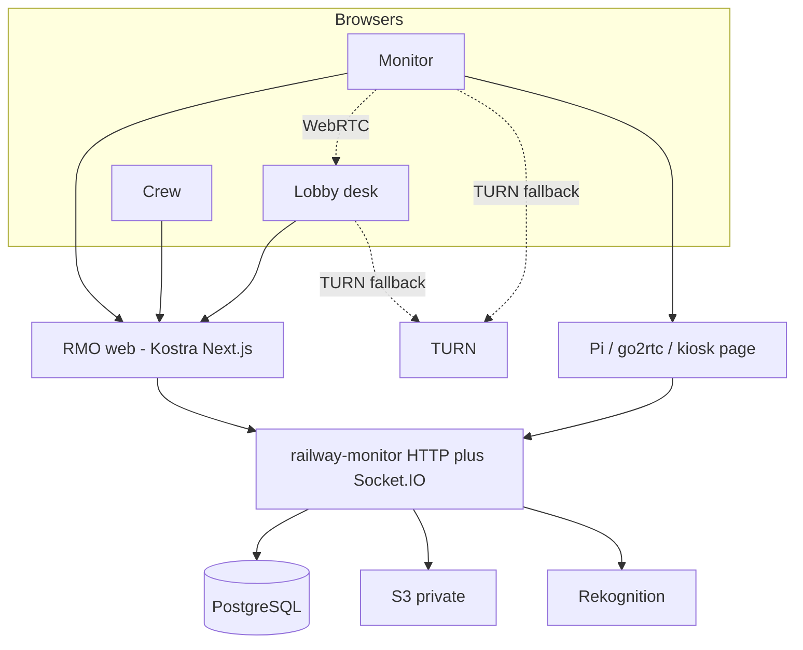

| Component | Need |
| --- | --- |
| RMO web | Kostra, after SaaS removal. |
| PostgreSQL | Existing RMO database, migrated. Not the Kostra SaaS database. |
| Realtime | Same Node process as the API for v1. |
| WebRTC | Browsers. |
| TURN | Existing host. Capacity is the production limit (§9.4). |
| AI monitor | New worker, later phase. Not in the first process. |
| Visual impairment | Not scheduled until accepted. Separate service. |
| Cameras | Stay on the edge. Web only plays HLS and web views. |
| Evidence | Private S3, only if approved. |
| Monitoring | Sentry on the web. API logs slow queries over 200 ms with scope and route (§9.4). No APM product is in the repo. |
| Logging | `src/utils/logger.js` in the API. Do not log reset URLs. |

REQUIREMENT DECISION REQUIRED: one host or split web and API origins; who operates TURN; whether PM2 remains the deploy. The requirements assume about 100 concurrent people, one Node process, pool of 20 Postgres connections.

---

## 34. Proposed target architecture

Adapted from the requirements §9.1 and from what the repositories actually contain.

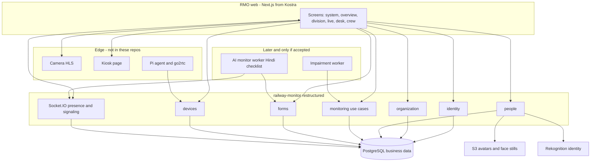

WebRTC media stays between browsers (and TURN). The API does not carry it.

Three AI capabilities stay separate:

| Capability | Question | Module |
| --- | --- | --- |
| Face recognition | Who is this? | `FACE_DETECTION` |
| AI monitor | Can an agent run the Hindi checklist and, if rules pass, fill the form? | `AI_MONITOR` |
| Visual impairment | Does recent visible behavior show indicators? | Not a module until accepted |

---

## 35. Session, auth, and impairment flows

### Auth (target)

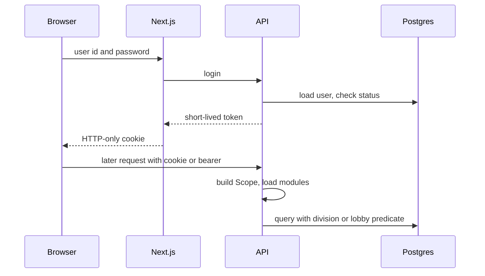

### Call

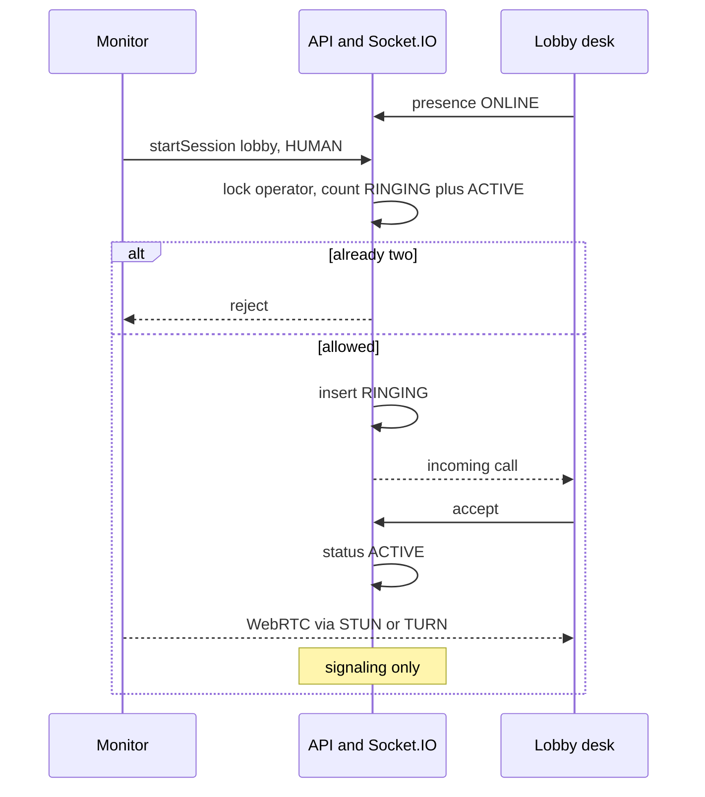

### Impairment (only if accepted)

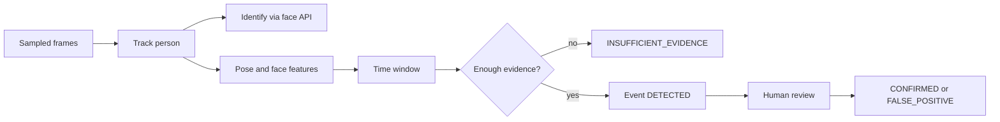

---

## 36. Decision matrix

| Area | Existing | RMO required | Gap | Decision | Priority |
| --- | --- | --- | --- | --- | --- |
| Web foundation | Kostra Next.js SaaS | Operations console | Domain pages are the wrong product | Strip SaaS, keep shell | P0 |
| API foundation | Express + Socket.IO | Same, restructured by module | Controllers own SQL; no Scope | Refactor inside `railway-monitor` | P0 |
| Database | Two unrelated schemas | One RMO schema, UUID | Kostra integer users | Evolve Railway Monitor. Do not merge into current Prisma models | P0 |
| ORM | Sequelize and Prisma | Unspecified | Dual migration paths, plus `sequelize.sync()` | Pick one owner for schema changes | P0 |
| Roles | 2 in Kostra, 4 in API | 6 roles | `USER` is both desk and crew. Super admin creates divisions | New enum and migration plan | P0 |
| Zones | Absent | Required | Divisions have no parent | Add `zones` | P0 |
| Scope | Ad hoc | `system/division/lobby/self` on every list | Middleware unused. Global socket rooms | One Scope helper | P0 |
| Home vs actual lobby | Session lobby copied from device. Submission has no lobby | Both stored, never assumed equal | No `home_lobby_id`, no `crew_user_id` | Columns and query rules in section 6 | P0 |
| Section 15 decisions | Written as unconfirmed | Build is blocked on them by the doc header | — | Accept or amend the requirements file | P0 |
| Visual impairment | Absent | Not in the requirements file | Discovery task only | Do not build until accepted | P0 |
| Modules | Absent | Four paid flags, three always on | No enforcement | `division_modules` and transactional dependencies | P1 |
| Passwords | API link reset works. JWT never expires. Kostra uses OTP | Every role can reset. Admin reset audited | No change-password route. No revoke. Mail can “succeed” when logged | Fix auth before lobby go-live | P1 |
| Sessions | Device lock, status `ACTIVE` immediately | Lobby call, operator, state machine | No checklist, identity, recording facts, or two-call cap | Extend `monitoring_sessions` | P1 |
| Two-call limit | Unlimited per monitor | Max two, server-side | No lock | Transaction plus row lock | P1 |
| WebRTC | Implemented in Flutter and Socket.IO | Same media path in the browser | No Next.js client | New client on existing signaling | P1 |
| Forms | Global active template, no submission state | Versioned, scoped, draft/submit/lock | Publish mutates live questions | Version snapshot | P1 |
| Face | Rekognition, threshold 80, no session state | Name on the call, division-limited, confirm low confidence | Collection is global | Filter and store match state | P1 |
| Presence | `socket_presence` plus global rooms | Upsert, division and lobby rooms | Cross-division room | Change joins | P1 |
| Devices | Mixed config and runtime | Split, HLS and web view | Add-camera UI is a failing button in Flutter | Admin device screen. Runtime upsert | P1 |
| Audit read | Writes only | System screen filters | No `division_id`, no GET | Extend and expose | P1 |
| AI monitor | Absent | Hindi agent, same session | No speech stack | Phase after human call works | P2 |
| Registers and Excel | Working | Keep, later | Not first screens | Port after submissions | P2 |
| CCTV and agents | Working API, partial UI | Keep | Health UI unused | After the call and the form | P2 |
| Public form | Working, shared password | “Stays” but insecure | Account model clash | Decision, then fix or remove | P2 |
| Observers | Implemented | Not in requirements | Extra peer | Keep or drop | P2 |
| Safety events | Absent | Not in requirements | — | Design only after impairment is accepted | P3 |
| Evidence clips | Absent | Not in requirements | Call video must stay off the server | Separate decision | P3 |
| Redis | Absent | Explicitly not in v1 | Second process would need it | Defer | P3 |
| Workspace drag layout | Flutter, local only | Browser memory in requirements; DB in the spec | 5k-line screen | Grid first | P3 |
| Marketing site | Kostra branding | Console, not a marketing site | — | Remove from this app | P1 |

---

## 37. Requirement decisions required

Only items the inspected documents and code do not settle.

1. Accept or amend `PRODUCT_REQUIREMENTS_AND_ARCHITECTURE.md` section 15 (super admin is watch-only, system admin is separate, monitor sees every lobby, checklist versus form, division admin resets crew and lobby passwords, form lifecycle, seed zone names West / East / Middle, home versus actual lobby). The header still blocks development on this list.
2. Is `WAITING` a session state (§9.7) or only lobby presence (§3, §9.4)?
3. Column name: `users.lobby_id` (§9.3) or `home_lobby_id` (§9.7)?
4. Can a crew member sign on in a division that is not their home division, and which division’s monitor can see that submission?
5. Keep public self-signup and the pending queue, or only admin-created accounts?
6. Keep the public unauthenticated form? If yes, what replaces the shared password `12345678`?
7. Templates: one set per division, or one global set gated by the module flag?
8. Unique submission: per crew per day (rebuild spec) or per crew per actual lobby per day (requirements §9.3)?
9. Who may type answers at the desk: crew only, or lobby user as well?
10. Correction after `LOCKED`: who, new row or side record, required reason?
11. Numeric face-match threshold and who confirms a low-confidence candidate. Code uses 80.
12. AI speech vendor, Hindi confidence cutoff, and whether transcript text is visible to the division admin.
13. `LOCKED` account trigger (failed attempts or manual only).
14. Session revoke: is a 24-hour cookie enough, or must role change, disable, and password reset kill existing tokens immediately?
15. Minimum password length 6 (API) or 8 (rebuild spec).
16. May division admin read `/audit` for their division, or only system admin?
17. Keep observer watchers?
18. Keep `DVR` and `NVR` on the canvas?
19. Is visual impairment a product feature at all? If yes: name in the UI, module or not, division-level mode `OFF`/`SHADOW`/`ACTIVE`, who can move an event to `CONFIRMED`, and whether any alert is crew-visible.
20. Retention duration for every category in section 25, especially face images, snapshots, transcripts, and audit logs.
21. May evidence include a short server-side clip, given that call recordings must not be uploaded?
22. TURN provider and capacity owner. The hostname is hard-coded; the contract is not in the repo.
23. Edge versus cloud for any future vision model, camera FPS, and whether lower body is in frame. Not specified because the feature is not specified.
24. Deploy topology: PM2 on one host versus split web and API. ORM: Sequelize remains or Prisma replaces it without changing the logical model.
25. Single product name. The rebuild spec notes MonitorSync, RailWatch, and Remote Monitoring System.
26. Cross-division face collections: one AWS collection filtered in software, or one collection per division?

---

## 38. Implementation phases

No phase below should start by editing Kostra’s SaaS schema into an RMO schema. Phase 0 is a written decision, not code.

### Phase 0 — Architecture decisions

Close section 37 items 1–8 and 24. Confirm that Railway Monitor’s database remains the system of record and Kostra is the web shell. Confirm `WAITING` is presence, or amend §9.7. Confirm visual impairment is out of the first build.

### Phase 1 — Kostra cleanup

Remove billing, credits, blogs, campaigns, Google, and marketing routes from the web app that will host RMO. Keep App Router, proxy, cookie helpers, table, dialog, Zod, React Query, Sentry, S3 helper. Do not point this app at the Kostra SaaS database for crew data.

### Phase 2 — Identity, zones, modules

On the API: zones, six roles, home lobby, `Scope`, `division_modules` with transactional dependencies, expiring tokens, forgot-password and change-password, admin reset with audit, disable without deleting history. System screens for zone and division. This matches requirements build order step 1.

### Phase 3 — People

Division admin creates lobby logins and crew. Home assignment. System admin creates the first division admin and monitor. Migration plan for existing `USER` rows stays manual until each account is classified.

### Phase 4 — Forms

Versioned templates per the decision in item 7. Submission stores actual zone, division, lobby, home lobby, session id, version id, and status. Lists are SQL-scoped. Uniqueness matches the decision in item 8. Crew UI renders every field type.

### Phase 5 — Presence

Division and lobby socket rooms. Upsert presence. Online list does not start a call unless Live session is on.

### Phase 6 — Sessions and WebRTC

`startSession(lobby, operator)`, state machine, two-call transaction, signaling only in `RINGING` and `ACTIVE`, checklist, local recording metadata, both-sides video in the Next.js client, ICE from the API. Cameras and kiosks on the same canvas without consuming a slot.

### Phase 7 — Face recognition

Enrollment UI, division-filtered search, session identity states, name on the lobby picture. No submission assignment from a match alone.

### Phase 8 — AI monitor

After the human call and the form exist. Same session function. Hindi path. Auto-fill only when §10 rules pass. Not in the same milestone as face recognition.

### Phase 9 — Safety events and visual impairment

Do not schedule until item 19 is accepted. Then: separate worker, events, review states, model version columns. No bottle detector. No medical label.

### Phase 10 — Devices

HLS cameras, named kiosks from `stream_url`, configuration versus health, command menu, drop hardcoded kiosk1/kiosk2 as the source of the list.

### Phase 11 — Hardening

Audit read API, rate limits, CORS allow-list, remove legacy auth and `/webrtc-test`, token revoke per the decision in item 14, tests in section 32, Sentry scrubbing, slow-query log. Registers, Excel, and public form sit here or just before, after submissions are trustworthy.

---

## 39. Highest-risk mistakes to avoid

1. Treating Kostra’s `User` and Stripe plan as the RMO tenant model.
2. Copying `submission.lobby_id` from `users.home_lobby_id`.
3. Leaving the two-call limit in the Flutter or React client.
4. Publishing forms by flipping `is_active` and editing questions in place, then expecting old submissions to stay stable.
5. Letting Rekognition similarity mean impairment, or letting it auto-assign the sign-on.
6. Putting the vision model, the Hindi agent, and face search behind one “AI” flag.
7. Inserting a `monitoring_sessions` row for every online lobby if `WAITING` is later judged to be presence.
8. Uploading the monitor’s recording. The requirements forbid it.
9. Starting feature work while section 15 of the requirements file is still marked unaccepted.
